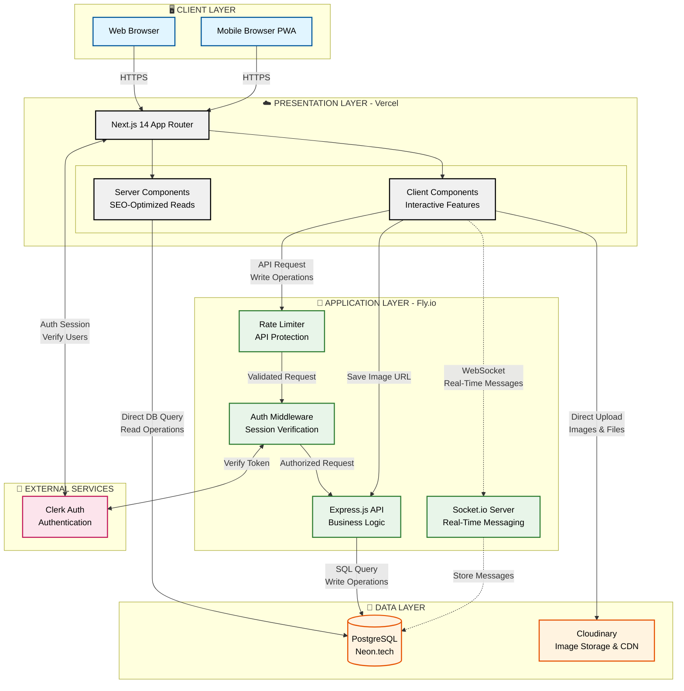
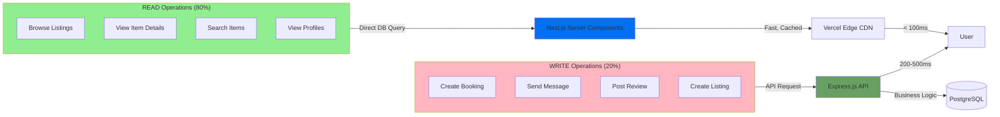
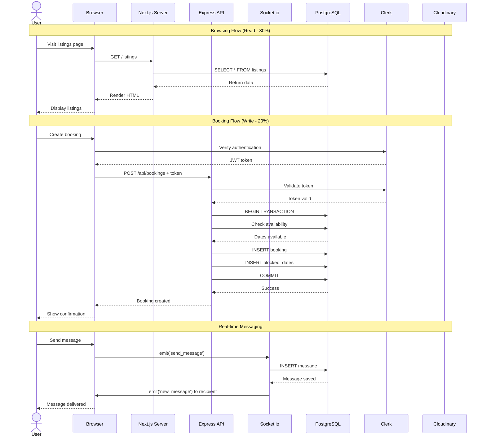
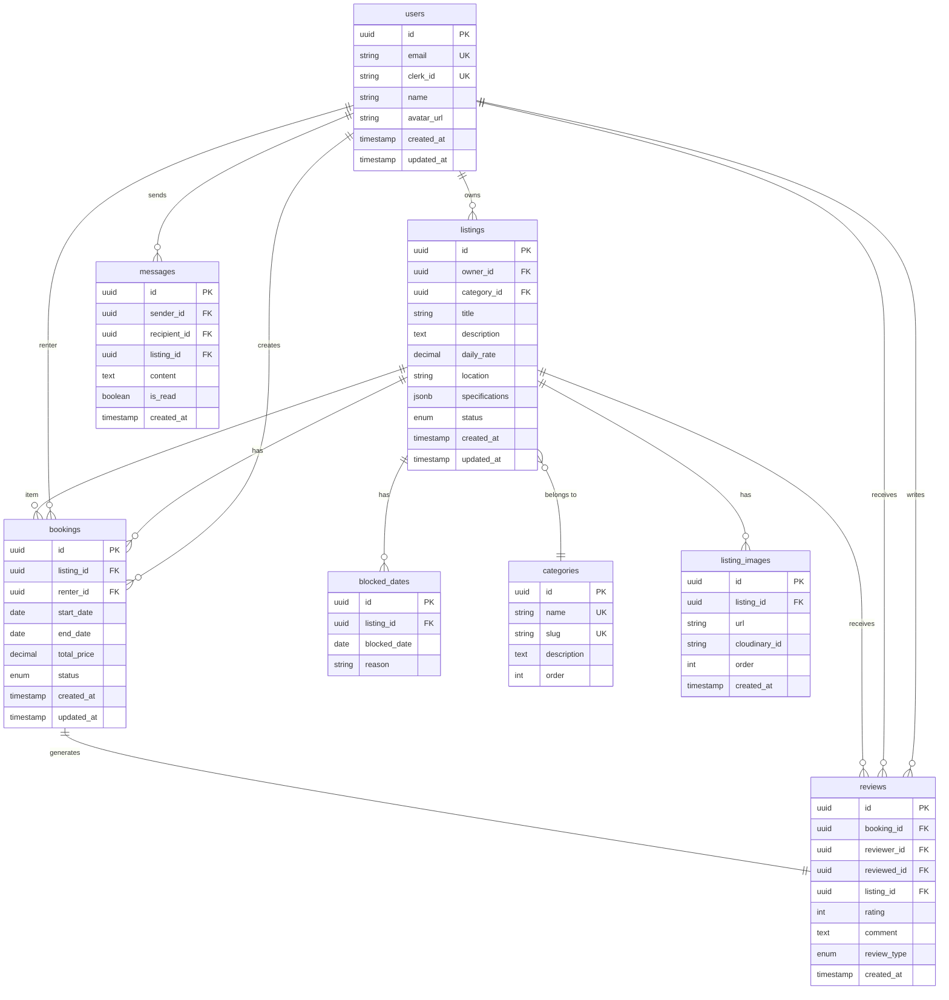
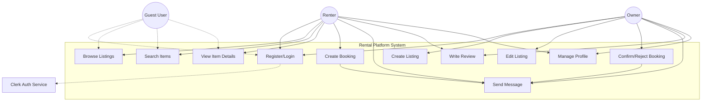
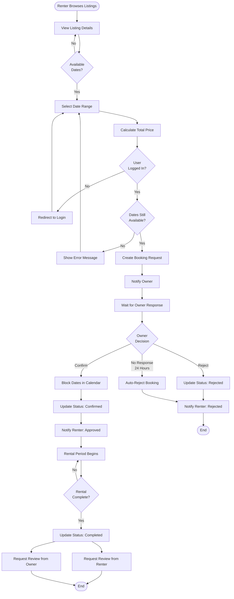
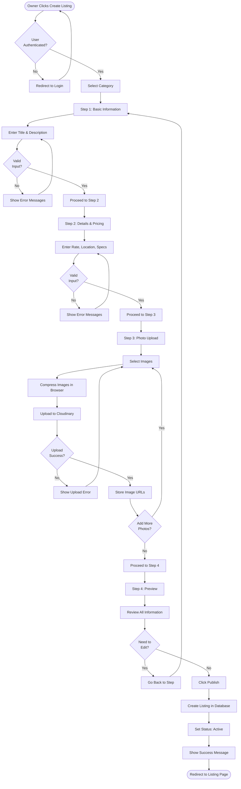
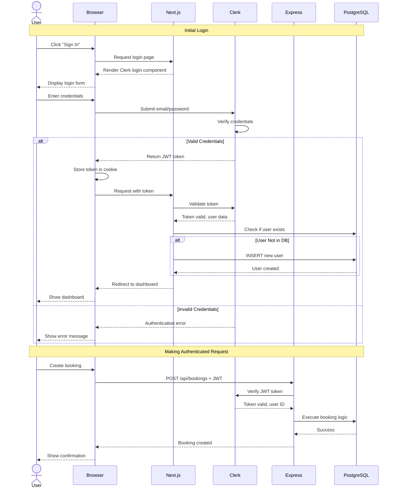
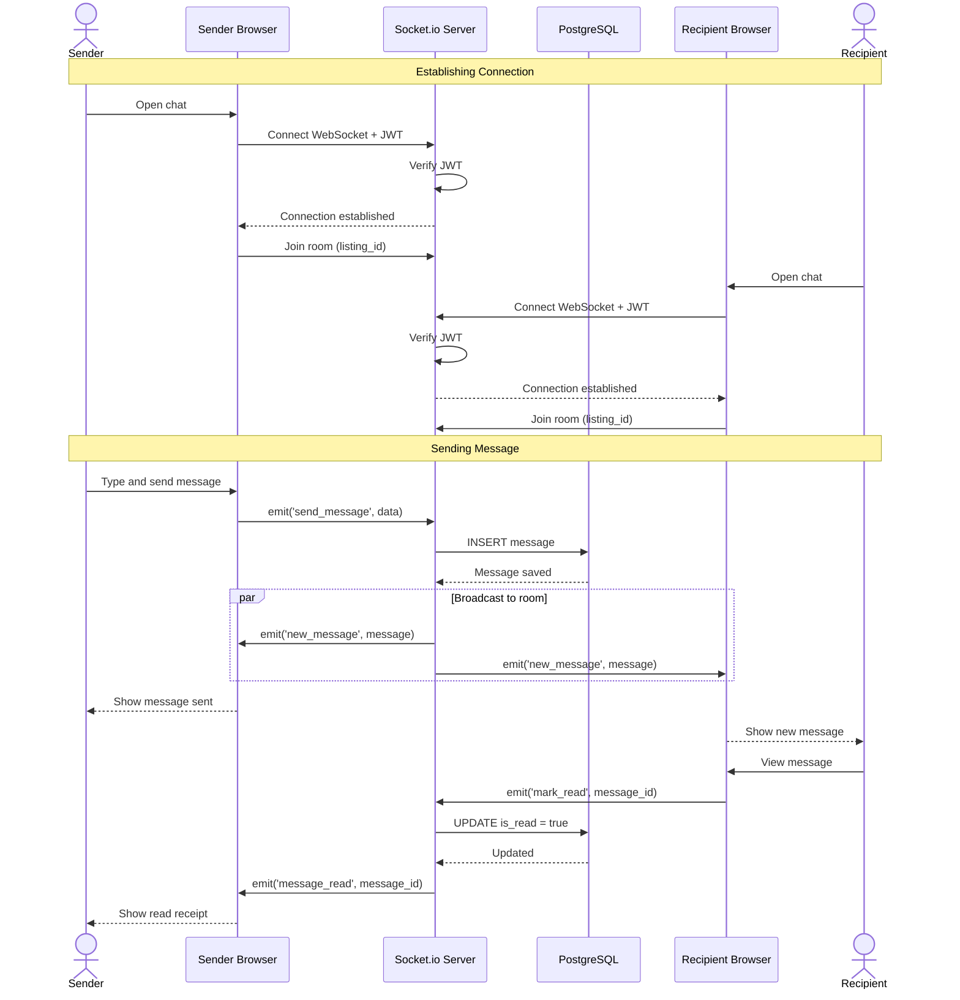

# Chapter 3: System Analysis and Design

This chapter presents the complete analysis and design of the peer-to-peer rental platform. We begin by identifying the functional and non-functional requirements that guide our system development. The system architecture follows a hybrid approach, combining Next.js for the frontend with Express.js for the backend. Database design uses PostgreSQL with carefully planned relationships between entities. Use cases demonstrate how different actors interact with the system, while process models show the flow of key operations. Finally, we document the RESTful API that serves as the communication bridge between components.

---

## 3.1 Requirements Analysis

Requirements analysis forms the foundation of our system design. We categorize requirements into functional and non-functional types to ensure comprehensive coverage of system capabilities.

### 3.1.1 Functional Requirements

The system must provide specific features to enable peer-to-peer item rentals. These requirements are prioritized based on their importance to the minimum viable product.

**High Priority (Must Have):**

1. **User Authentication and Authorization**
   - Users must register using email and password or Google OAuth
   - The system authenticates users before allowing access to protected features
   - Different authorization levels exist for item owners and renters

2. **Item Listing Management**
   - Owners can create new listings with title, description, pricing, and photos
   - The system supports up to 5 photos per listing with automatic compression
   - Owners can edit and delete their own listings
   - All users can browse and search available listings

3. **Category System**
   - The system organizes items into 6 main categories
   - Users filter listings by category during browsing
   - Each item belongs to exactly one category

4. **Search and Filter**
   - Users search listings by keywords in title and description
   - Filter options include category, price range, and location
   - Search results display in real-time as users type

5. **Booking Management**
   - Users can view item availability through a calendar interface
   - The system creates booking requests for selected date ranges
   - Owners receive notifications of new booking requests
   - Owners approve or reject bookings within 24 hours
   - The system blocks dates automatically after booking approval

6. **Real-time Messaging**
   - Users communicate through an in-app messaging system
   - Messages deliver in real-time using WebSocket connections
   - The system stores message history in the database
   - Users see online/offline status of conversation partners

7. **Review System**
   - Both renters and owners can leave reviews after rental completion
   - Reviews include a star rating (1-5) and text feedback
   - The system displays reviews only after both parties submit theirs
   - User profiles show aggregate review scores

8. **User Profiles**
   - Each user has a profile showing their listings and reviews
   - Profiles display verification status and join date
   - Users can update their profile information and avatar

**Medium Priority (Should Have):**

9. **Notification System**
   - Users receive email notifications for booking requests
   - In-app notifications appear for messages and booking updates
   - Users can configure notification preferences

10. **Image Upload and Optimization**
    - The system compresses images before upload to reduce storage
    - Images upload directly to Cloudinary from the browser
    - Failed uploads show clear error messages to users

**Low Priority (Could Have):**

11. **Wishlist/Favorites**
    - Users can save interesting listings for later viewing
    - The wishlist persists across sessions

12. **Location-based Search**
    - Users can search for items near their location
    - The system displays approximate distance to items

### 3.1.2 Non-Functional Requirements

Non-functional requirements define quality attributes that the system must exhibit during operation.

**Performance Requirements:**

- Page load time must not exceed 5 seconds on 3G mobile connections
- API response time should stay under 500ms for 95% of requests
- The system handles at least 100 concurrent users without degradation
- Database queries complete within 200ms for simple operations
- Image loading uses lazy loading to improve perceived performance

**Security Requirements:**

- All data transmission occurs over HTTPS encrypted connections
- User passwords undergo hashing before storage in the database
- The system validates all user inputs to prevent SQL injection attacks
- Cross-site scripting (XSS) protection applies to all user-generated content
- Authentication tokens expire after 24 hours of inactivity
- Rate limiting prevents abuse of API endpoints

**Scalability Requirements:**

- The database supports at least 10,000 users initially
- The system architecture allows horizontal scaling of the backend
- File storage handles up to 50,000 images in the first year
- Message history retains for up to 6 months without performance impact

**Reliability Requirements:**

- System uptime target is 99% excluding planned maintenance
- Database backups occur automatically every 24 hours
- Failed transactions roll back completely to maintain data consistency
- The system logs all errors for debugging and monitoring

**Usability Requirements:**

- The interface is responsive and works on mobile, tablet, and desktop
- Users can complete core tasks (browse, book, message) within 3 clicks
- Error messages provide clear guidance on correcting issues
- The system supports both English and Urdu languages (Phase 2)

**Maintainability Requirements:**

- Code follows TypeScript for type safety and better documentation
- The API uses RESTful conventions for predictable endpoints
- Database schema includes proper foreign keys and constraints
- The system uses environment variables for configuration

---

## 3.2 System Architecture

The architecture of our platform adopts a hybrid approach that combines the strengths of modern frontend frameworks with traditional backend separation. This design decision stems from analyzing the traffic patterns typical of rental platforms.

### 3.2.1 High-Level Architecture

The system consists of three main tiers: presentation, application, and data. The presentation layer uses Next.js 14 with the App Router for both server-side rendering and client-side interactivity. The application layer splits between Next.js Server Components and an Express.js API server. The data layer uses PostgreSQL hosted on Neon.tech with Row Level Security enabled.



**Figure 3.1:** High-level system architecture showing the hybrid Next.js and Express.js approach with PostgreSQL database and external services.

### 3.2.2 Architecture Justification

The decision to use a hybrid architecture rather than a monolithic approach comes from analyzing traffic patterns in rental platforms. Research shows that approximately 80% of requests in marketplace applications are read operations (browsing listings, viewing details, searching), while only 20% are write operations (creating bookings, sending messages, posting reviews).

**Read Operations (80% of Traffic):**
These operations benefit from Next.js Server Components because they render on the server and can be cached at the edge. When a user browses listings, Next.js fetches data directly from PostgreSQL, renders HTML on the server, and delivers it quickly to the client. This approach is faster than traditional client-side rendering and costs nothing on Vercel's free tier. The content also benefits search engine optimization since it arrives as complete HTML.

**Write Operations (20% of Traffic):**
These operations require complex business logic, transaction handling, and real-time communication. Express.js excels at these tasks because it provides full control over request handling, database transactions, and WebSocket connections. For example, creating a booking involves checking availability, creating multiple database records, sending notifications, and potentially rolling back on errors. This logic is more maintainable in a dedicated API server than scattered across Next.js route handlers.

The hybrid approach offers several advantages over alternatives:

1. **Performance:** Read-heavy operations serve from Vercel's global CDN, while write operations run on a dedicated server optimized for processing.

2. **Cost Efficiency:** Next.js on Vercel handles thousands of read requests for free, while the Express server only processes write operations that justify the hosting cost.

3. **Scalability:** Each layer scales independently. If read traffic increases, Next.js handles it automatically. If write operations increase, we scale only the Express server.

4. **Development Experience:** Team members can work on frontend features without touching backend code and vice versa. The API contract serves as the boundary between layers.

5. **Technology Fit:** Next.js is excellent for UI rendering and SEO, while Express is battle-tested for APIs and real-time features.

### 3.2.3 Traffic Pattern Analysis

Understanding our traffic patterns helps justify architectural decisions. The following diagram illustrates how different operations flow through the system.



**Figure 3.2:** Traffic pattern distribution showing how read and write operations take different paths through the system.

Most users spend their time browsing and searching before making a booking decision. This browsing generates many read requests but few writes. By serving reads through Next.js, we ensure fast page loads without overloading the Express server. When users finally decide to book an item, the Express API handles the complex booking creation with full transaction support.

### 3.2.4 Component Communication Flow

Components in our system communicate through well-defined interfaces. The following patterns ensure clean separation of concerns:

**Next.js to PostgreSQL (Direct):**
Server Components execute on Vercel's servers and can query PostgreSQL directly using Drizzle ORM. This eliminates the overhead of HTTP requests for read operations. The connection uses SSL and connection pooling for security and performance.

**Client Components to Express API (HTTP/REST):**
Client-side JavaScript cannot access the database directly for security reasons. Instead, Client Components make HTTP requests to the Express API. The API validates requests, executes business logic, and returns JSON responses. Authentication tokens pass in request headers.

**Client to Socket.io (WebSocket):**
Real-time messaging requires bidirectional communication. Clients establish WebSocket connections to the Socket.io server running alongside Express. Once connected, messages flow instantly in both directions without HTTP overhead. The connection authenticates using the same JWT token as the REST API.

**Express to PostgreSQL (Transactional):**
The Express server uses Drizzle ORM for database access. Complex operations wrap in transactions to ensure atomicity. For example, creating a booking either completes fully (booking record + blocked dates + notification) or rolls back completely if any step fails.



**Figure 3.3:** Sequence diagram showing communication patterns for read operations, write operations, and real-time messaging.

---

## 3.3 Database Design

The database schema organizes data into normalized tables with clear relationships. We use PostgreSQL because it provides ACID transactions, referential integrity, and excellent support for complex queries.

### 3.3.1 Entity-Relationship Diagram

The ER diagram shows the main entities in our system and their relationships. Core entities include users, listings, bookings, messages, and reviews.



**Figure 3.4:** Entity-Relationship diagram showing core database tables and their relationships.

### 3.3.2 Database Schema Description

**Users Table:**
This table stores all user accounts. Each user has a unique identifier (UUID) and connects to Clerk for authentication via the `clerk_id` field. The email serves as an additional unique identifier. Avatar URLs point to Cloudinary images. Timestamps track account creation and profile updates.

**Listings Table:**
Item listings contain all information about rentable items. The `owner_id` links to the users table, establishing who owns the listing. Categories organize items through the `category_id` foreign key. The `specifications` field uses JSONB to store category-specific attributes flexibly. For example, camera listings include sensor size and lens mount, while tools include power specifications. The `status` enum tracks whether listings are active, paused, or deleted. Daily rate stores pricing in PKR as a decimal for precision.

**Categories Table:**
A simple lookup table for the six main categories. The `slug` field creates URL-friendly category names. The `order` field controls display sequence in navigation menus. This table changes rarely but is referenced frequently.

**Listing Images Table:**
Images live separately from listings to support multiple photos per item. Each image stores both the Cloudinary URL and the Cloudinary ID (for deletion). The `order` field determines which image appears first in galleries. This separation allows easy addition or removal of images without modifying the main listing record.

**Bookings Table:**
The bookings table tracks all rental requests and confirmed rentals. Each booking links to a listing and a renter. Start and end dates define the rental period. Total price calculates from the daily rate and number of days. The `status` enum progresses through states: pending, confirmed, completed, cancelled, or rejected. Timestamps record when bookings were created and last modified.

**Blocked Dates Table:**
This table prevents double-booking by marking unavailable dates. Each entry blocks one specific date for one listing. The `reason` field explains why (booking, maintenance, owner unavailable). When a booking is confirmed, the system inserts entries for each date in the range. When a booking cancels, it removes those entries. This design allows efficient availability checking with a simple date range query.

**Messages Table:**
Messages enable communication between users. Each message links to sender, recipient, and optionally the listing being discussed. The `is_read` flag tracks whether the recipient has seen the message. Messages store as plain text with timestamp ordering. This table can grow large, so we index heavily on sender, recipient, and timestamp fields.

**Reviews Table:**
The reviews table implements a two-way review system. Each review links to a specific booking, identifying the reviewer and the reviewed party. The `review_type` enum distinguishes between renter reviews and owner reviews for the same booking. Ratings range from 1 to 5 stars. Comments provide detailed feedback. Reviews only become visible after both parties submit theirs or 14 days pass.

### 3.3.3 Relationships and Constraints

**One-to-Many Relationships:**

- A user owns many listings, but each listing has one owner
- A listing has many bookings, but each booking is for one listing
- A user creates many bookings, but each booking has one renter
- A listing has many images, but each image belongs to one listing

**Many-to-One Relationships:**

- Many listings belong to one category
- Many messages reference one listing (optional)

**One-to-One Relationships:**

- Each booking generates at most two reviews (one from each party)

**Constraints and Rules:**

1. **Foreign Key Constraints:** All foreign keys use ON DELETE CASCADE or RESTRICT based on data sensitivity. Deleting a listing cascades to its images and blocked dates but restricts if active bookings exist.

2. **Unique Constraints:** User emails and Clerk IDs must be unique. Category slugs must be unique. This prevents duplicate accounts and naming conflicts.

3. **Check Constraints:** 
   - Booking end dates must be after start dates
   - Review ratings must be between 1 and 5
   - Daily rates must be positive numbers
   - Maximum 5 images per listing (enforced at application level)

4. **Not Null Constraints:** Critical fields like user emails, listing titles, and booking dates cannot be null. This ensures data integrity.

5. **Indexes:** 
   - Primary keys have automatic indexes
   - Foreign keys have indexes for join performance
   - The messages table indexes sender_id + created_at for inbox queries
   - The blocked_dates table indexes listing_id + blocked_date for availability checks
   - The listings table indexes category_id + status for filtered browsing

### 3.3.4 Normalization and Data Integrity

The schema follows Third Normal Form (3NF) principles:

**First Normal Form (1NF):** All fields contain atomic values. We avoid storing multiple images in a single field by creating the listing_images table. Similarly, blocked dates have their own table rather than storing date ranges.

**Second Normal Form (2NF):** All non-key attributes depend on the entire primary key. In the bookings table, the total_price depends on the booking ID, not just the listing or renter.

**Third Normal Form (3NF):** No transitive dependencies exist. User information lives in the users table, not duplicated in bookings or messages. Category names live in categories, not copied into listings.

**Exceptions for Performance:**

We denormalize slightly in a few cases for query performance:

- The reviews table includes both `reviewed_id` and `listing_id` even though listing_id could be derived from booking_id. This avoids a three-table join when displaying listing reviews.

- Message records include `listing_id` even though it could be inferred from context. This allows filtering conversations by listing without complex joins.

These tradeoffs improve read performance at minimal cost to storage.

---

## 3.4 Use Case Analysis

Use cases describe how actors interact with the system to achieve specific goals. Our platform has two primary actors: item owners and renters. Some users play both roles at different times.

### 3.4.1 Use Case Diagram



**Figure 3.5:** Use case diagram showing interactions between actors and system features.

### 3.4.2 Detailed Use Case Descriptions

**Use Case 1: User Registration and Authentication**

- **Actor:** Guest User
- **Preconditions:** User has valid email address or Google account
- **Main Flow:**
  1. User navigates to registration page
  2. User chooses email registration or Google OAuth
  3. For email: User enters email and password
  4. For Google: User authorizes via Google consent screen
  5. System creates account via Clerk
  6. System creates user record in database
  7. System redirects to profile completion
  8. User provides name and location
  9. System saves profile and redirects to dashboard
- **Postconditions:** User is authenticated and can access protected features
- **Alternative Flows:**
  - If email already exists, show error and offer login
  - If OAuth fails, show error and retry option

**Use Case 2: Browse and Search Listings**

- **Actor:** Any User (authenticated or guest)
- **Preconditions:** None
- **Main Flow:**
  1. User visits listings page
  2. System displays all active listings with pagination
  3. User applies filters (category, price range, location)
  4. System updates results in real-time
  5. User types search keywords
  6. System filters by title and description match
  7. User sorts by price, date, or rating
  8. System reorders results
- **Postconditions:** User sees relevant listings
- **Alternative Flows:**
  - If no results match filters, show suggestions
  - If search query is empty, show all listings

**Use Case 3: Create New Listing**

- **Actor:** Owner
- **Preconditions:** User is authenticated
- **Main Flow:**
  1. Owner clicks "List Your Item" button
  2. System displays category selection
  3. Owner selects category
  4. System shows multi-step form
  5. Step 1: Owner enters title, description
  6. Owner proceeds to next step
  7. Step 2: Owner enters daily rate, location, specifications
  8. Owner proceeds to next step
  9. Step 3: Owner uploads photos
  10. System compresses and uploads to Cloudinary
  11. Owner proceeds to preview
  12. Step 4: Owner reviews all information
  13. Owner clicks publish
  14. System creates listing in database
  15. System displays success message
- **Postconditions:** Listing is active and visible to others
- **Alternative Flows:**
  - Owner can save draft at any step
  - If upload fails, show error and allow retry
  - Owner can go back to edit previous steps

**Use Case 4: Create Booking Request**

- **Actor:** Renter
- **Preconditions:** User is authenticated and viewing a listing
- **Main Flow:**
  1. Renter views item detail page
  2. System displays availability calendar
  3. Renter selects start date
  4. Renter selects end date
  5. System highlights selected range
  6. System calculates total price
  7. Renter clicks "Request Booking"
  8. System validates date availability
  9. System creates booking with "pending" status
  10. System sends notification to owner
  11. System displays confirmation to renter
- **Postconditions:** Booking request exists and owner is notified
- **Alternative Flows:**
  - If dates are unavailable, show error
  - If user is not logged in, redirect to login
  - If user tries to book their own item, prevent

**Use Case 5: Confirm or Reject Booking**

- **Actor:** Owner
- **Preconditions:** Booking request exists for owner's listing
- **Main Flow:**
  1. Owner receives notification of booking request
  2. Owner navigates to bookings page
  3. System displays pending requests
  4. Owner views booking details
  5. Owner reviews renter profile
  6. Owner clicks "Confirm" or "Reject"
  7. If confirmed:
     - System updates booking status to "confirmed"
     - System creates blocked dates for the period
     - System notifies renter
  8. If rejected:
     - System updates booking status to "rejected"
     - System notifies renter with optional reason
- **Postconditions:** Booking is confirmed or rejected, both parties notified
- **Alternative Flows:**
  - If owner doesn't respond in 24 hours, auto-reject

**Use Case 6: Real-time Messaging**

- **Actor:** Owner and Renter
- **Preconditions:** Both users are authenticated
- **Main Flow:**
  1. User clicks "Message" on listing or booking
  2. System opens messaging interface
  3. System loads previous message history
  4. User types message
  5. User presses send
  6. System sends via WebSocket to Socket.io server
  7. Server saves message to database
  8. Server emits message to recipient if online
  9. Recipient sees message appear instantly
  10. System marks message as delivered
- **Postconditions:** Message is saved and delivered
- **Alternative Flows:**
  - If recipient is offline, deliver when they reconnect
  - If connection drops, queue message and retry

**Use Case 7: Submit Review**

- **Actor:** Owner or Renter
- **Preconditions:** Booking is completed
- **Main Flow:**
  1. User receives notification to leave review
  2. User navigates to review form
  3. System displays booking details
  4. User selects star rating (1-5)
  5. User writes text review
  6. User clicks submit
  7. System validates rating is between 1-5
  8. System creates review record
  9. If both parties have reviewed:
     - System makes both reviews visible
     - System updates user rating scores
  10. System displays thank you message
- **Postconditions:** Review is saved and may be visible
- **Alternative Flows:**
  - If user already reviewed, prevent duplicate
  - If 14 days pass, publish single review

---

## 3.5 Process Modeling

Process models illustrate the flow of operations through the system. We use activity diagrams to show the steps in key processes and sequence diagrams to show component interactions.

### 3.5.1 Activity Diagram: Booking Process

The booking process involves multiple steps and decision points. This activity diagram shows the complete flow from browsing to confirmed rental.



**Figure 3.6:** Activity diagram showing the complete booking process from request to completion.

### 3.5.2 Activity Diagram: Listing Creation Process

Creating a listing involves multiple steps with validation at each stage. This ensures only complete, valid listings become public.



**Figure 3.7:** Activity diagram showing the multi-step listing creation process with validation points.

### 3.5.3 Sequence Diagram: Authentication Flow

Authentication uses Clerk for secure user verification. This sequence shows the complete authentication process.



**Figure 3.8:** Sequence diagram showing authentication flow with Clerk integration.

### 3.5.4 Sequence Diagram: Real-time Messaging Flow

Real-time messaging uses WebSocket connections for instant delivery. This sequence demonstrates the message lifecycle.



**Figure 3.9:** Sequence diagram showing real-time messaging with Socket.io WebSocket connections.

---

## 3.6 API Design

The Express.js API provides RESTful endpoints for all write operations and complex queries. The API follows REST conventions with consistent URL patterns, HTTP methods, and response formats.

### 3.6.1 API Architecture Principles

**RESTful Design:**
We structure endpoints around resources (listings, bookings, messages) using standard HTTP methods. GET retrieves data, POST creates new resources, PUT/PATCH updates existing resources, and DELETE removes resources. This convention makes the API predictable and easy to consume.

**Authentication:**
All protected endpoints require a valid JWT token from Clerk in the Authorization header. The middleware verifies tokens before processing requests. Invalid or expired tokens receive a 401 Unauthorized response.

**Rate Limiting:**
To prevent abuse, the API implements rate limiting at 100 requests per minute per IP address. Exceeded limits return a 429 Too Many Requests response with a Retry-After header.

**Error Handling:**
Errors follow a consistent format with HTTP status codes and descriptive messages. Validation errors (400) include field-level details. Server errors (500) log to monitoring systems but return generic messages to clients.

**Response Format:**
All responses use JSON with a consistent structure:

```json
{
  "success": true,
  "data": { ... },
  "message": "Optional success message"
}
```

For errors:

```json
{
  "success": false,
  "error": "Error message",
  "details": { ... }
}
```

### 3.6.2 Core API Endpoints

**Listings Endpoints:**

```
GET /api/listings
Description: Retrieve all active listings with optional filters
Query Parameters:
  - category: Filter by category ID
  - minPrice, maxPrice: Price range filter
  - location: Filter by location string
  - search: Search in title and description
  - page: Pagination page number (default 1)
  - limit: Items per page (default 20)
Response: Array of listing objects with pagination metadata
```

```
GET /api/listings/:id
Description: Retrieve detailed information for a specific listing
Parameters:
  - id: Listing UUID
Response: Single listing object with owner details and images
```

```
POST /api/listings
Description: Create a new listing
Authentication: Required
Body:
  - title: string (required)
  - description: string (required)
  - category_id: UUID (required)
  - daily_rate: decimal (required)
  - location: string (required)
  - specifications: object (optional)
  - image_urls: array of strings (required)
Response: Created listing object
```

```
PATCH /api/listings/:id
Description: Update an existing listing
Authentication: Required (must be owner)
Parameters:
  - id: Listing UUID
Body: Any listing fields to update
Response: Updated listing object
```

```
DELETE /api/listings/:id
Description: Delete a listing (soft delete by setting status)
Authentication: Required (must be owner)
Parameters:
  - id: Listing UUID
Response: Success message
```

**Booking Endpoints:**

```
GET /api/bookings
Description: Retrieve user's bookings (as renter or owner)
Authentication: Required
Query Parameters:
  - role: 'renter' or 'owner'
  - status: Filter by booking status
Response: Array of booking objects
```

```
GET /api/bookings/:id
Description: Retrieve specific booking details
Authentication: Required
Parameters:
  - id: Booking UUID
Response: Booking object with listing and user details
```

```
POST /api/bookings
Description: Create a new booking request
Authentication: Required
Body:
  - listing_id: UUID (required)
  - start_date: date (required)
  - end_date: date (required)
Response: Created booking object
Validation:
  - Dates must be in the future
  - End date must be after start date
  - Dates must not overlap with blocked dates
```

```
PATCH /api/bookings/:id/confirm
Description: Owner confirms a booking request
Authentication: Required (must be listing owner)
Parameters:
  - id: Booking UUID
Response: Updated booking with confirmed status
Side Effects:
  - Creates blocked_dates entries
  - Sends notification to renter
```

```
PATCH /api/bookings/:id/reject
Description: Owner rejects a booking request
Authentication: Required (must be listing owner)
Parameters:
  - id: Booking UUID
Body:
  - reason: string (optional)
Response: Updated booking with rejected status
```

```
PATCH /api/bookings/:id/complete
Description: Mark a booking as completed
Authentication: Required
Parameters:
  - id: Booking UUID
Response: Updated booking with completed status
Side Effects:
  - Triggers review request notifications
```

**Message Endpoints:**

```
GET /api/messages/conversations
Description: Get list of user's conversations
Authentication: Required
Response: Array of conversations with last message and participant info
```

```
GET /api/messages/conversation/:userId
Description: Get message history with a specific user
Authentication: Required
Parameters:
  - userId: UUID of other user
Query Parameters:
  - listing_id: Optional listing context
  - limit: Messages to retrieve (default 50)
  - before: Message ID for pagination
Response: Array of message objects ordered by timestamp
```

```
POST /api/messages
Description: Send a new message (via REST as fallback)
Authentication: Required
Body:
  - recipient_id: UUID (required)
  - listing_id: UUID (optional)
  - content: string (required, max 1000 chars)
Response: Created message object
Note: Real-time sending uses Socket.io, this is HTTP fallback
```

```
PATCH /api/messages/:id/read
Description: Mark a message as read
Authentication: Required (must be recipient)
Parameters:
  - id: Message UUID
Response: Success message
```

**Review Endpoints:**

```
GET /api/reviews/listing/:listingId
Description: Get all reviews for a specific listing
Parameters:
  - listingId: Listing UUID
Response: Array of review objects
```

```
GET /api/reviews/user/:userId
Description: Get all reviews received by a user
Parameters:
  - userId: User UUID
Response: Array of review objects with aggregate rating
```

```
POST /api/reviews
Description: Submit a review for a completed booking
Authentication: Required
Body:
  - booking_id: UUID (required)
  - rating: integer 1-5 (required)
  - comment: string (required)
  - review_type: 'renter' or 'owner' (required)
Response: Created review object
Validation:
  - Booking must be completed
  - User must be part of booking
  - User cannot review twice for same booking
```

**User Endpoints:**

```
GET /api/users/:id
Description: Get public profile information
Parameters:
  - id: User UUID
Response: User object with public fields and rating
```

```
PATCH /api/users/profile
Description: Update own profile
Authentication: Required
Body:
  - name: string (optional)
  - avatar_url: string (optional)
  - location: string (optional)
Response: Updated user object
```

**Availability Endpoints:**

```
GET /api/listings/:id/availability
Description: Check availability for a date range
Parameters:
  - id: Listing UUID
Query Parameters:
  - start_date: Date to check from
  - end_date: Date to check until
Response: Object with available status and blocked dates
```

### 3.6.3 WebSocket Events (Socket.io)

Real-time features use Socket.io events instead of HTTP endpoints:

**Client to Server Events:**

```
connect
Description: Establish WebSocket connection
Auth: JWT token in connection handshake
Response: Connection acknowledgment
```

```
send_message
Description: Send a real-time message
Payload:
  - recipient_id: UUID
  - listing_id: UUID (optional)
  - content: string
Response: Message delivered event
```

```
join_room
Description: Join a listing conversation room
Payload:
  - listing_id: UUID
Response: Room joined confirmation
```

```
typing
Description: Notify that user is typing
Payload:
  - recipient_id: UUID
Response: Typing indicator to recipient
```

**Server to Client Events:**

```
new_message
Description: Receive a new message
Payload: Complete message object
```

```
message_read
Description: Notification that message was read
Payload:
  - message_id: UUID
```

```
user_online
Description: User came online
Payload:
  - user_id: UUID
```

```
user_offline
Description: User went offline
Payload:
  - user_id: UUID
```

---

## Summary

This chapter presented the complete analysis and design of the peer-to-peer rental platform. We identified functional requirements like listings, bookings, and messaging alongside non-functional requirements for performance and security. The hybrid architecture combines Next.js for fast read operations with Express.js for complex write logic, justified by the 80/20 traffic pattern typical of rental platforms.

Database design uses eight core tables in Third Normal Form with proper relationships and constraints. Use cases demonstrate how renters and owners interact with the system to achieve their goals. Process models illustrate the booking flow and listing creation through activity diagrams, while sequence diagrams show authentication and real-time messaging communication patterns.

Finally, the RESTful API provides a clean interface with consistent endpoints, authentication, and error handling. The combination of HTTP endpoints for standard operations and WebSocket events for real-time features creates a robust foundation for implementation. The next chapter will detail how these designs translate into working code.

---

**End of Chapter 3**
