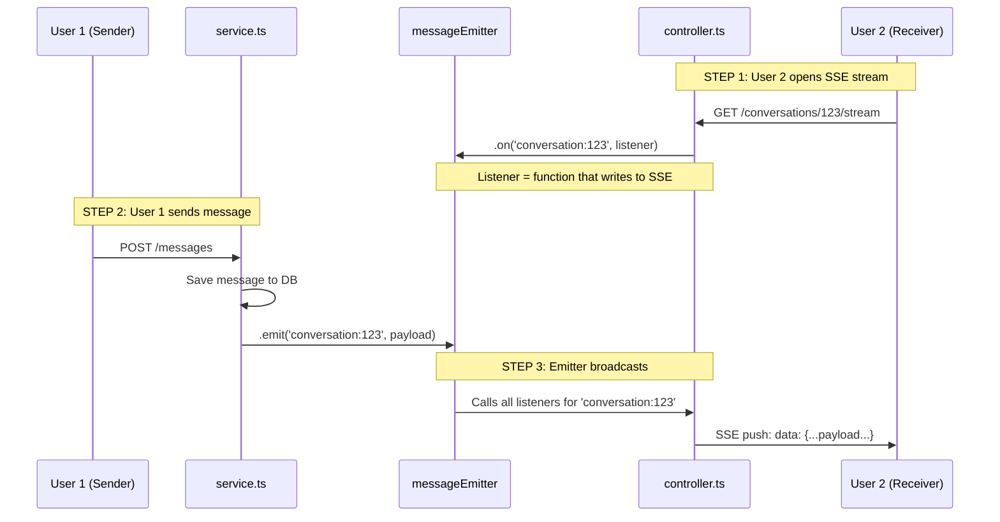

Read [](file:///home/apic/codeSPACE/stuFlux/apps/api/src/modules/messages/service.ts#1-1), lines 1 to 75

Read [](file:///home/apic/codeSPACE/stuFlux/apps/api/src/modules/messages/controller.ts#40-40), lines 40 to 80

Read [](file:///home/apic/codeSPACE/stuFlux/apps/api/src/modules/messages/controller.ts#78-78), lines 78 to 94

## Who Calls Emitter & The Pub/Sub Pattern

### The Complete Flow



---

## 1. Who Calls `.emit()` (Publisher)

**Location:** service.ts

```typescript
// Line 47-48 in sendMessage()
const eventPayload = { ...message, conversation_id: conversation.id };
messageEmitter.emit(`conversation:${conversation.id}`, eventPayload);
```

**Also called from:** service.ts in deleteMessage()

```typescript
// Line 76
messageEmitter.emit(`conversation:${msg.conversation_id}`, { ...msg, deleted: true });
```

**When:**
- After message is saved to database
- After message is marked as delivered (if user online)
- When message is soft-deleted

**Why in service layer?**
- Service = business logic layer
- Emitting event IS part of business logic (notify listeners)
- Controller shouldn't know about event broadcasting

---

## 2. Who Calls `.on()` (Subscriber)

**Location:** controller.ts

```typescript
// Line 86 in streamConversationHandler
const listener = (payload: any) => {
  res.write(`data: ${JSON.stringify(payload)}\n\n`);
};

messageEmitter.on(`conversation:${id}`, listener);
```

**When:**
- User opens SSE stream: `GET /conversations/:id/stream`
- SSE connection established
- Listener function registered

**Why in controller?**
- Controller = HTTP/SSE response handling
- Listener writes directly to HTTP response stream
- Service shouldn't touch HTTP response

---

## 3. The Pattern: Pub/Sub (Publish-Subscribe)

### Traditional Function Call (Tightly Coupled)
```typescript
// ❌ Bad: Service directly calls controller
function sendMessage() {
  const msg = saveToDb();
  controller.pushToSSE(msg); // Tight coupling!
}
```

**Problems:**
- Service knows about controller (violates separation)
- Can't have multiple receivers
- Hard to test

---

### Event Pattern (Loosely Coupled)
```typescript
// ✅ Good: Service emits event, doesn't care who listens
function sendMessage() {
  const msg = saveToDb();
  messageEmitter.emit('conversation:123', msg); // Fire and forget
}

// Elsewhere: Controller listens
messageEmitter.on('conversation:123', (msg) => {
  pushToSSE(msg);
});
```

**Benefits:**
- Service doesn't know controller exists
- Multiple listeners possible (SSE, webhooks, logs, analytics)
- Easy to test (mock emit, verify payload)

---

## 4. Why Channel Name vs Payload?

### The Confusion

```typescript
messageEmitter.emit(`conversation:${conversation.id}`, eventPayload);
//                   ^^^^^^^^^^^^^^^^^^^^^^^^^^^^^^    ^^^^^^^^^^^^
//                   Channel (routing)                 Data (content)
```

**Why separate?**

### Channel Name = **Routing Key** (WHERE to send)

Think of it like **postal zip codes**:

```typescript
// These are different "channels" (different zip codes)
emit('conversation:123', messageData)
emit('conversation:456', messageData)
emit('conversation:789', messageData)
```

**Purpose:**
- Filter which listeners receive the event
- Only listeners subscribed to that exact channel get notified
- Like tuning a radio to specific frequency

**Example:**
```typescript
// User A listening to conversation 123
messageEmitter.on('conversation:123', listener);

// User B listening to conversation 456  
messageEmitter.on('conversation:456', listener);

// Emit to 123
emit('conversation:123', {body: "Hello"});
// ✅ User A receives
// ❌ User B does NOT receive (different channel)
```

---

### Payload = **Actual Data** (WHAT to send)

The content being delivered:

```typescript
const eventPayload = {
  id: "msg-uuid-123",
  conversation_id: "conv-123",
  sender_id: "user-42",
  body: "Hello world",
  created_at: "2026-01-16T10:00:00Z",
  delivered_at: "2026-01-16T10:00:01Z",
  read_at: null,
};

emit('conversation:123', eventPayload);
//                       ^^^^^^^^^^^^^^ This is what listeners receive
```

**Why include conversation_id in payload too?**

Good question! It's redundant in the channel name, but useful in payload:

```typescript
// Channel: Used for ROUTING (who gets it)
emit('conversation:123', payload);

// Payload: Used for PROCESSING (what to do with it)
const listener = (payload) => {
  console.log(payload.conversation_id); // "123"
  // Listener doesn't need to parse channel name
  // All data is in payload
};
```

---

## 5. Real-World Analogy

### Discord Server Example

```
Channel Name = Discord channel #general, #random, #support
Payload = The actual message content

User posts in #general:
  discord.emit('channel:general', {
    author: 'Alice',
    text: 'Hello everyone',
    timestamp: '10:00 AM'
  });

Only users watching #general see it.
Users in #random don't see it (different channel).
```

---

## 6. Complete Flow Diagram

```typescript
// ========================================
// STEP 1: User Bob opens SSE stream
// ========================================
GET /conversations/123/stream

→ Controller executes:
  const listener = (payload) => {
    res.write(`data: ${JSON.stringify(payload)}\n\n`);
  };
  
  messageEmitter.on('conversation:123', listener);
  //                ^^^^^^^^^^^^^^^^^^^^^  Registers Bob's listener

// Internal state:
// messageEmitter listeners = {
//   'conversation:123': [listener_bob]
// }


// ========================================
// STEP 2: User Alice sends message
// ========================================
POST /messages { body: "Hi Bob", conversation_id: "123" }

→ Service executes:
  1. Save message to DB
     → message = { id: "msg-1", body: "Hi Bob", ... }
  
  2. Check if Bob online
     → isUserConnected('123', 'bob-id') → TRUE
  
  3. Mark delivered
     → delivered_at = NOW
  
  4. Emit event
     messageEmitter.emit('conversation:123', {
       id: "msg-1",
       body: "Hi Bob",
       conversation_id: "123",
       sender_id: "alice-id",
       delivered_at: "2026-01-16T10:00:00Z"
     });


// ========================================
// STEP 3: Emitter broadcasts
// ========================================
Internally in messageEmitter:
  1. Look up 'conversation:123' in listeners Map
     → Found: [listener_bob]
  
  2. Call each listener with payload
     → listener_bob({ id: "msg-1", body: "Hi Bob", ... })


// ========================================
// STEP 4: Bob's listener executes
// ========================================
const listener = (payload) => {
  res.write(`data: ${JSON.stringify(payload)}\n\n`);
  // Writes to Bob's SSE stream
};

→ Bob's browser receives:
  data: {"id":"msg-1","body":"Hi Bob","conversation_id":"123",...}


// ========================================
// STEP 5: Bob closes tab
// ========================================
Browser disconnects → req.on('close') fires

→ Controller cleanup:
  messageEmitter.off('conversation:123', listener);
  // Removes Bob's listener
  
  untrackStream('123', 'bob-id');
  // Removes Bob from activeStreams

// Internal state:
// messageEmitter listeners = {
//   'conversation:123': [] // Empty, no one listening
// }
```

---

## 7. Why This Design?

### Separation of Concerns

| Layer | Responsibility | Knows About |
|-------|---------------|-------------|
| **Service** | Business logic, emit events | messageEmitter (emit only) |
| **Controller** | HTTP/SSE handling, listen to events | messageEmitter (on/off only) |
| **Emitter** | Route events to listeners | Neither service nor controller |

### Multiple Listeners Example

```typescript
// You could add MORE listeners for same channel:

// Listener 1: SSE stream (already exists)
messageEmitter.on('conversation:123', (payload) => {
  res.write(`data: ${JSON.stringify(payload)}\n\n`);
});

// Listener 2: Logging (future feature)
messageEmitter.on('conversation:123', (payload) => {
  logger.info('Message sent', payload);
});

// Listener 3: Webhooks (future feature)
messageEmitter.on('conversation:123', (payload) => {
  sendWebhook('https://example.com/webhook', payload);
});

// Single emit() triggers ALL three listeners
messageEmitter.emit('conversation:123', payload);
```

---

## Key Takeaways

**1. emit() = Publisher**
- Called from: service.ts
- When: After DB operation (save/delete)
- What: Broadcasts event to channel
- Why: Notify anyone interested (loose coupling)

**2. on() = Subscriber**
- Called from: controller.ts  
- When: SSE stream opens
- What: Registers listener function
- Why: Receive events and push to client

**3. Channel Name = Routing**
- `'conversation:123'` = WHERE to send
- Filters which listeners receive
- Like a radio frequency

**4. Payload = Data**
- `eventPayload` = WHAT to send
- Actual message content
- What listeners process

**5. Why Both?**
```typescript
emit('WHERE', 'WHAT')
emit('conversation:123', messageData)
     ^^^^^^^^^^^^^^^^    ^^^^^^^^^^^
     Routing key         Content
```

The pattern allows **one service** (message sender) to notify **many controllers** (SSE streams, logs, webhooks) without knowing they exist. Clean, scalable, testable.