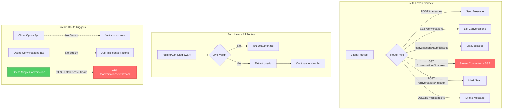
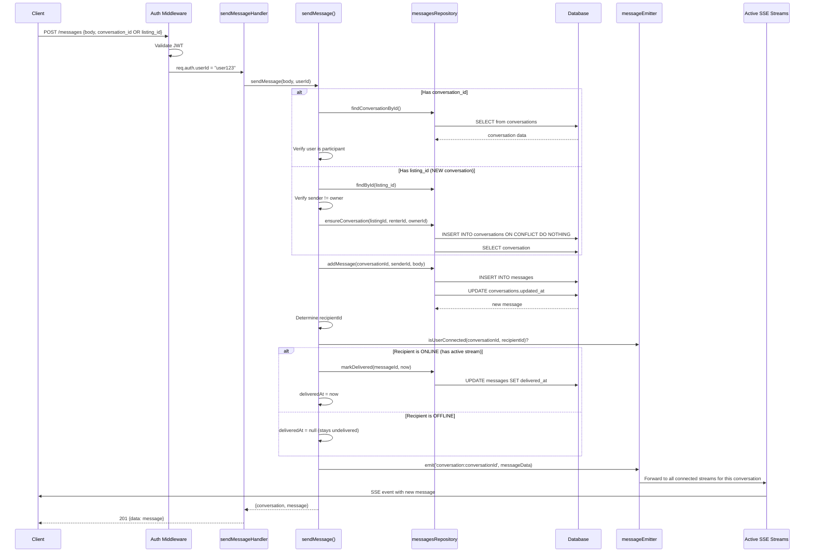
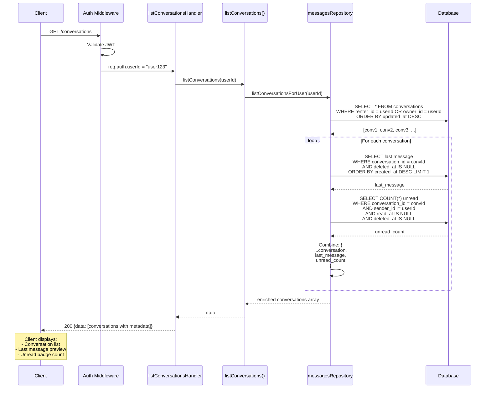
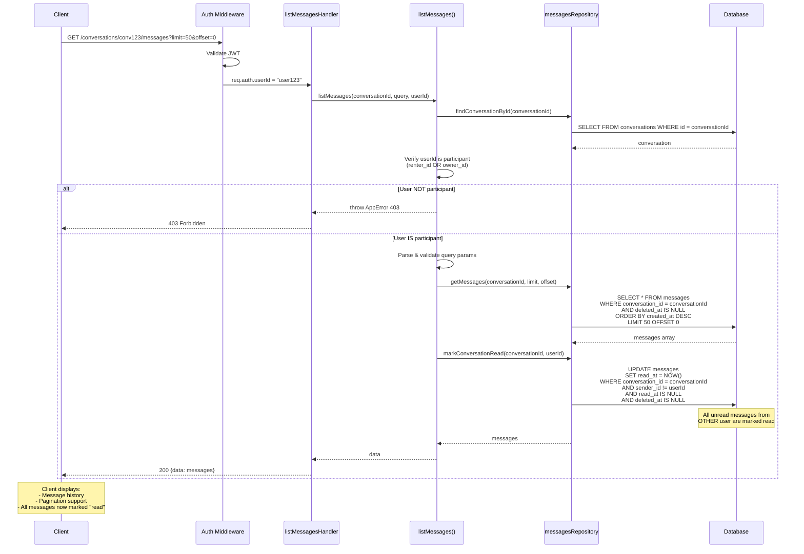
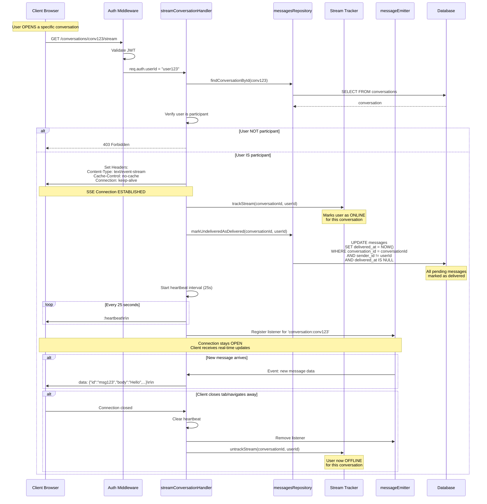
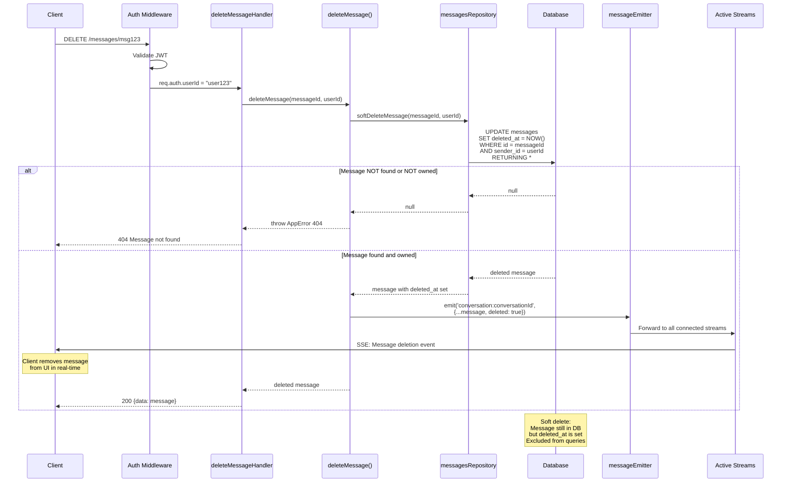
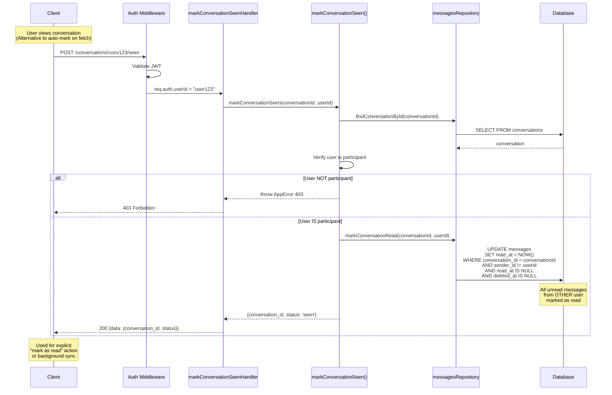
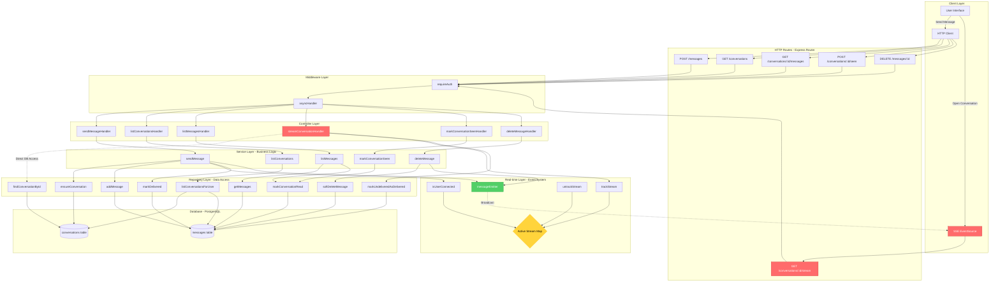

```mermaid
graph TB
    subgraph "Route Level Overview"
        A[Client Request] --> B{Route Type}
        B -->|POST /messages| C[Send Message]
        B -->|GET /conversations| D[List Conversations]
        B -->|GET /conversations/:id/messages| E[List Messages]
        B -->|GET /conversations/:id/stream| F[Stream Connection - SSE]
        B -->|POST /conversations/:id/seen| G[Mark Seen]
        B -->|DELETE /messages/:id| H[Delete Message]
    end
    
    subgraph "Auth Layer - All Routes"
        I[requireAuth Middleware] --> J{JWT Valid?}
        J -->|No| K[401 Unauthorized]
        J -->|Yes| L[Extract userId]
        L --> M[Continue to Handler]
    end
    
    subgraph "Stream Route Triggers"
        N[Client Opens App] -.->|No Stream| O[Just fetches data]
        P[Opens Conversations Tab] -.->|No Stream| Q[Just lists conversations]
        R[Opens Single Conversation] -->|YES - Establishes Stream| S[GET /conversations/:id/stream]
    end
    
    style F fill:#ff6b6b,stroke:#c92a2a,color:#fff
    style R fill:#51cf66,stroke:#2f9e44,color:#fff
    style S fill:#ff6b6b,stroke:#c92a2a,color:#fff
```

```mermaid

sequenceDiagram
    participant C as Client
    participant Auth as Auth Middleware
    participant Controller as sendMessageHandler
    participant Service as sendMessage()
    participant Repo as messagesRepository
    participant DB as Database
    participant Emitter as messageEmitter
    participant Stream as Active SSE Streams
    
    C->>Auth: POST /messages {body, conversation_id OR listing_id}
    Auth->>Auth: Validate JWT
    Auth->>Controller: req.auth.userId = "user123"
    
    Controller->>Service: sendMessage(body, userId)
    
    alt Has conversation_id
        Service->>Repo: findConversationById()
        Repo->>DB: SELECT from conversations
        DB-->>Repo: conversation data
        Service->>Service: Verify user is participant
    else Has listing_id (NEW conversation)
        Service->>Repo: findById(listing_id)
        Service->>Service: Verify sender != owner
        Service->>Repo: ensureConversation(listingId, renterId, ownerId)
        Repo->>DB: INSERT INTO conversations ON CONFLICT DO NOTHING
        Repo->>DB: SELECT conversation
    end
    
    Service->>Repo: addMessage(conversationId, senderId, body)
    Repo->>DB: INSERT INTO messages
    Repo->>DB: UPDATE conversations.updated_at
    DB-->>Repo: new message
    
    Service->>Service: Determine recipientId
    Service->>Emitter: isUserConnected(conversationId, recipientId)?
    
    alt Recipient is ONLINE (has active stream)
        Service->>Repo: markDelivered(messageId, now)
        Repo->>DB: UPDATE messages SET delivered_at
        Service->>Service: deliveredAt = now
    else Recipient is OFFLINE
        Service->>Service: deliveredAt = null (stays undelivered)
    end
    
    Service->>Emitter: emit('conversation:conversationId', messageData)
    Emitter->>Stream: Forward to all connected streams for this conversation
    Stream->>C: SSE event with new message
    
    Service-->>Controller: {conversation, message}
    Controller-->>C: 201 {data: message}
```

```mermaid

sequenceDiagram
    participant C as Client
    participant Auth as Auth Middleware
    participant Controller as listConversationsHandler
    participant Service as listConversations()
    participant Repo as messagesRepository
    participant DB as Database
    
    C->>Auth: GET /conversations
    Auth->>Auth: Validate JWT
    Auth->>Controller: req.auth.userId = "user123"
    
    Controller->>Service: listConversations(userId)
    Service->>Repo: listConversationsForUser(userId)
    
    Repo->>DB: SELECT * FROM conversations<br/>WHERE renter_id = userId OR owner_id = userId<br/>ORDER BY updated_at DESC
    DB-->>Repo: [conv1, conv2, conv3, ...]
    
    loop For each conversation
        Repo->>DB: SELECT last message<br/>WHERE conversation_id = convId<br/>AND deleted_at IS NULL<br/>ORDER BY created_at DESC LIMIT 1
        DB-->>Repo: last_message
        
        Repo->>DB: SELECT COUNT(*) unread<br/>WHERE conversation_id = convId<br/>AND sender_id != userId<br/>AND read_at IS NULL<br/>AND deleted_at IS NULL
        DB-->>Repo: unread_count
        
        Repo->>Repo: Combine: {<br/>  ...conversation,<br/>  last_message,<br/>  unread_count<br/>}
    end
    
    Repo-->>Service: enriched conversations array
    Service-->>Controller: data
    Controller-->>C: 200 {data: [conversations with metadata]}
    
    Note over C: Client displays:<br/>- Conversation list<br/>- Last message preview<br/>- Unread badge count
```

```mermaid

sequenceDiagram
    participant C as Client
    participant Auth as Auth Middleware
    participant Controller as listMessagesHandler
    participant Service as listMessages()
    participant Repo as messagesRepository
    participant DB as Database
    
    C->>Auth: GET /conversations/conv123/messages?limit=50&offset=0
    Auth->>Auth: Validate JWT
    Auth->>Controller: req.auth.userId = "user123"
    
    Controller->>Service: listMessages(conversationId, query, userId)
    
    Service->>Repo: findConversationById(conversationId)
    Repo->>DB: SELECT FROM conversations WHERE id = conversationId
    DB-->>Repo: conversation
    
    Service->>Service: Verify userId is participant<br/>(renter_id OR owner_id)
    
    alt User NOT participant
        Service-->>Controller: throw AppError 403
        Controller-->>C: 403 Forbidden
    else User IS participant
        Service->>Service: Parse & validate query params
        
        Service->>Repo: getMessages(conversationId, limit, offset)
        Repo->>DB: SELECT * FROM messages<br/>WHERE conversation_id = conversationId<br/>AND deleted_at IS NULL<br/>ORDER BY created_at DESC<br/>LIMIT 50 OFFSET 0
        DB-->>Repo: messages array
        
        Service->>Repo: markConversationRead(conversationId, userId)
        Repo->>DB: UPDATE messages<br/>SET read_at = NOW()<br/>WHERE conversation_id = conversationId<br/>AND sender_id != userId<br/>AND read_at IS NULL<br/>AND deleted_at IS NULL
        
        Note over DB: All unread messages from<br/>OTHER user are marked read
        
        Repo-->>Service: messages
        Service-->>Controller: data
        Controller-->>C: 200 {data: messages}
    end
    
    Note over C: Client displays:<br/>- Message history<br/>- Pagination support<br/>- All messages now marked "read"
```

```mermaid

sequenceDiagram
    participant C as Client Browser
    participant Auth as Auth Middleware
    participant Controller as streamConversationHandler
    participant Repo as messagesRepository
    participant Tracker as Stream Tracker
    participant Emitter as messageEmitter
    participant DB as Database
    
    Note over C: User OPENS a specific conversation
    
    C->>Auth: GET /conversations/conv123/stream
    Auth->>Auth: Validate JWT
    Auth->>Controller: req.auth.userId = "user123"
    
    Controller->>Repo: findConversationById(conv123)
    Repo->>DB: SELECT FROM conversations
    DB-->>Repo: conversation
    
    Controller->>Controller: Verify user is participant
    
    alt User NOT participant
        Controller-->>C: 403 Forbidden
    else User IS participant
        Controller->>C: Set Headers:<br/>Content-Type: text/event-stream<br/>Cache-Control: no-cache<br/>Connection: keep-alive
        
        Note over C,Controller: SSE Connection ESTABLISHED
        
        Controller->>Tracker: trackStream(conversationId, userId)
        Note over Tracker: Marks user as ONLINE<br/>for this conversation
        
        Controller->>Repo: markUndeliveredAsDelivered(conversationId, userId)
        Repo->>DB: UPDATE messages<br/>SET delivered_at = NOW()<br/>WHERE conversation_id = conversationId<br/>AND sender_id != userId<br/>AND delivered_at IS NULL
        
        Note over DB: All pending messages<br/>marked as delivered
        
        Controller->>Controller: Start heartbeat interval (25s)
        
        loop Every 25 seconds
            Controller->>C: :heartbeat\n\n
        end
        
        Controller->>Emitter: Register listener for 'conversation:conv123'
        
        Note over C,Emitter: Connection stays OPEN<br/>Client receives real-time updates
        
        alt New message arrives
            Emitter->>Controller: Event: new message data
            Controller->>C: data: {"id":"msg123","body":"Hello",...}\n\n
        end
        
        alt Client closes tab/navigates away
            C->>Controller: Connection closed
            Controller->>Controller: Clear heartbeat
            Controller->>Emitter: Remove listener
            Controller->>Tracker: untrackStream(conversationId, userId)
            Note over Tracker: User now OFFLINE<br/>for this conversation
        end
    end
```

```mermaid
sequenceDiagram
    participant C as Client
    participant Auth as Auth Middleware
    participant Controller as deleteMessageHandler
    participant Service as deleteMessage()
    participant Repo as messagesRepository
    participant DB as Database
    participant Emitter as messageEmitter
    participant Stream as Active Streams
    
    C->>Auth: DELETE /messages/msg123
    Auth->>Auth: Validate JWT
    Auth->>Controller: req.auth.userId = "user123"
    
    Controller->>Service: deleteMessage(messageId, userId)
    Service->>Repo: softDeleteMessage(messageId, userId)
    
    Repo->>DB: UPDATE messages<br/>SET deleted_at = NOW()<br/>WHERE id = messageId<br/>AND sender_id = userId<br/>RETURNING *
    
    alt Message NOT found or NOT owned
        DB-->>Repo: null
        Repo-->>Service: null
        Service-->>Controller: throw AppError 404
        Controller-->>C: 404 Message not found
    else Message found and owned
        DB-->>Repo: deleted message
        Repo-->>Service: message with deleted_at set
        
        Service->>Emitter: emit('conversation:conversationId',<br/>{...message, deleted: true})
        
        Emitter->>Stream: Forward to all connected streams
        Stream->>C: SSE: Message deletion event
        
        Note over C: Client removes message<br/>from UI in real-time
        
        Service-->>Controller: deleted message
        Controller-->>C: 200 {data: message}
    end
    
    Note over DB: Soft delete:<br/>Message still in DB<br/>but deleted_at is set<br/>Excluded from queries
```

```mermaid

sequenceDiagram
    participant C as Client
    participant Auth as Auth Middleware
    participant Controller as markConversationSeenHandler
    participant Service as markConversationSeen()
    participant Repo as messagesRepository
    participant DB as Database
    
    Note over C: User views conversation<br/>(Alternative to auto-mark on fetch)
    
    C->>Auth: POST /conversations/conv123/seen
    Auth->>Auth: Validate JWT
    Auth->>Controller: req.auth.userId = "user123"
    
    Controller->>Service: markConversationSeen(conversationId, userId)
    
    Service->>Repo: findConversationById(conversationId)
    Repo->>DB: SELECT FROM conversations
    DB-->>Repo: conversation
    
    Service->>Service: Verify user is participant
    
    alt User NOT participant
        Service-->>Controller: throw AppError 403
        Controller-->>C: 403 Forbidden
    else User IS participant
        Service->>Repo: markConversationRead(conversationId, userId)
        
        Repo->>DB: UPDATE messages<br/>SET read_at = NOW()<br/>WHERE conversation_id = conversationId<br/>AND sender_id != userId<br/>AND read_at IS NULL<br/>AND deleted_at IS NULL
        
        Note over DB: All unread messages<br/>from OTHER user<br/>marked as read
        
        Service-->>Controller: {conversation_id, status: 'seen'}
        Controller-->>C: 200 {data: {conversation_id, status}}
    end
    
    Note over C: Used for explicit<br/>"mark as read" action<br/>or background sync
```

```mermaid
graph TB
    subgraph "Scenario 1: User Opens App"
        A1[User Opens App] --> A2[App Loads]
        A2 --> A3{What gets called?}
        A3 -->|Only| A4[GET /conversations]
        A4 --> A5[Displays list with<br/>unread counts]
        A5 -.->|NO STREAM| A6[No real-time yet]
    end
    
    subgraph "Scenario 2: User Opens Conversations Tab"
        B1[User Clicks<br/>Conversations Tab] --> B2{What gets called?}
        B2 -->|Only| B3[GET /conversations]
        B3 --> B4[Updates conversation list]
        B4 -.->|NO STREAM| B5[Still no real-time]
    end
    
    subgraph "Scenario 3: User Opens SPECIFIC Conversation"
        C1[User Clicks on<br/>Conversation] --> C2{What gets called?}
        C2 -->|First| C3[GET /conversations/:id/messages]
        C3 --> C4[Fetches message history]
        C2 -->|Second - STREAM STARTS| C5[GET /conversations/:id/stream]
        C5 --> C6[SSE Connection Opens]
        C6 --> C7[trackStream registers user]
        C7 --> C8[markUndeliveredAsDelivered]
        C8 --> C9[Heartbeat every 25s]
        C9 --> C10[Listen for events]
        
        C10 -.->|Real-time active| C11[New messages appear<br/>instantly via SSE]
    end
    
    subgraph "Scenario 4: User Navigates Away from Conversation"
        D1[User Leaves<br/>Conversation View] --> D2[SSE Connection Closes]
        D2 --> D3[untrackStream]
        D3 --> D4[User now OFFLINE<br/>for that conversation]
        D4 --> D5[Future messages will<br/>NOT be delivered until<br/>stream reopens]
    end
    
    subgraph "Scenario 5: User Receives Message While Stream Active"
        E1[Other User Sends<br/>Message] --> E2[POST /messages]
        E2 --> E3{Is recipient<br/>connected?}
        E3 -->|Yes - Stream Active| E4[Mark delivered_at = NOW]
        E3 -->|No - Offline| E5[delivered_at = NULL]
        E4 --> E6[Emit to stream]
        E6 --> E7[Client receives via SSE]
        E5 --> E8[Message pending delivery]
    end
    
    style C5 fill:#ff6b6b,stroke:#c92a2a,color:#fff
    style C6 fill:#ff6b6b,stroke:#c92a2a,color:#fff
    style C10 fill:#51cf66,stroke:#2f9e44,color:#fff
    style E4 fill:#51cf66,stroke:#2f9e44,color:#fff
    style E7 fill:#51cf66,stroke:#2f9e44,color:#fff
```

```mermaid
graph TB
    subgraph "Client Layer"
        C1[User Interface]
        C2[HTTP Client]
        C3[SSE EventSource]
    end
    
    subgraph "HTTP Routes - Express Router"
        R1[POST /messages]
        R2[GET /conversations]
        R3[GET /conversations/:id/messages]
        R4[GET /conversations/:id/stream]
        R5[POST /conversations/:id/seen]
        R6[DELETE /messages/:id]
    end
    
    subgraph "Middleware Layer"
        M1[requireAuth]
        M2[asyncHandler]
    end
    
    subgraph "Controller Layer"
        CO1[sendMessageHandler]
        CO2[listConversationsHandler]
        CO3[listMessagesHandler]
        CO4[streamConversationHandler]
        CO5[markConversationSeenHandler]
        CO6[deleteMessageHandler]
    end
    
    subgraph "Service Layer - Business Logic"
        S1[sendMessage]
        S2[listConversations]
        S3[listMessages]
        S4[markConversationSeen]
        S5[deleteMessage]
    end
    
    subgraph "Repository Layer - Data Access"
        RE1[ensureConversation]
        RE2[addMessage]
        RE3[markDelivered]
        RE4[listConversationsForUser]
        RE5[getMessages]
        RE6[markConversationRead]
        RE7[softDeleteMessage]
        RE8[markUndeliveredAsDelivered]
        RE9[findConversationById]
    end
    
    subgraph "Database - PostgreSQL"
        DB1[(conversations table)]
        DB2[(messages table)]
    end
    
    subgraph "Real-time Layer - Event System"
        E1[messageEmitter]
        E2[trackStream]
        E3[untrackStream]
        E4[isUserConnected]
        E5{Active Stream Map}
    end
    
    C1 -->|Send Message| C2
    C1 -->|Open Conversation| C3
    
    C2 --> R1
    C2 --> R2
    C2 --> R3
    C2 --> R5
    C2 --> R6
    C3 --> R4
    
    R1 --> M1
    R2 --> M1
    R3 --> M1
    R4 --> M1
    R5 --> M1
    R6 --> M1
    
    M1 --> M2
    
    M2 --> CO1
    M2 --> CO2
    M2 --> CO3
    M2 --> CO4
    M2 --> CO5
    M2 --> CO6
    
    CO1 --> S1
    CO2 --> S2
    CO3 --> S3
    CO4 -.->|Direct DB Access| RE9
    CO4 --> E2
    CO4 --> RE8
    CO5 --> S4
    CO6 --> S5
    
    S1 --> RE1
    S1 --> RE2
    S1 --> E4
    S1 --> RE3
    S1 --> E1
    
    S2 --> RE4
    S3 --> RE5
    S3 --> RE6
    S4 --> RE6
    S5 --> RE7
    S5 --> E1
    
    RE1 --> DB1
    RE2 --> DB2
    RE3 --> DB2
    RE4 --> DB1
    RE4 --> DB2
    RE5 --> DB2
    RE6 --> DB2
    RE7 --> DB2
    RE8 --> DB2
    RE9 --> DB1
    
    E1 -.->|Broadcast| C3
    E2 --> E5
    E3 --> E5
    E4 --> E5
    
    style R4 fill:#ff6b6b,stroke:#c92a2a,color:#fff
    style CO4 fill:#ff6b6b,stroke:#c92a2a,color:#fff
    style E1 fill:#51cf66,stroke:#2f9e44,color:#fff
    style E5 fill:#ffd43b,stroke:#fab005,color:#000
    style C3 fill:#ff6b6b,stroke:#c92a2a,color:#fff
```

