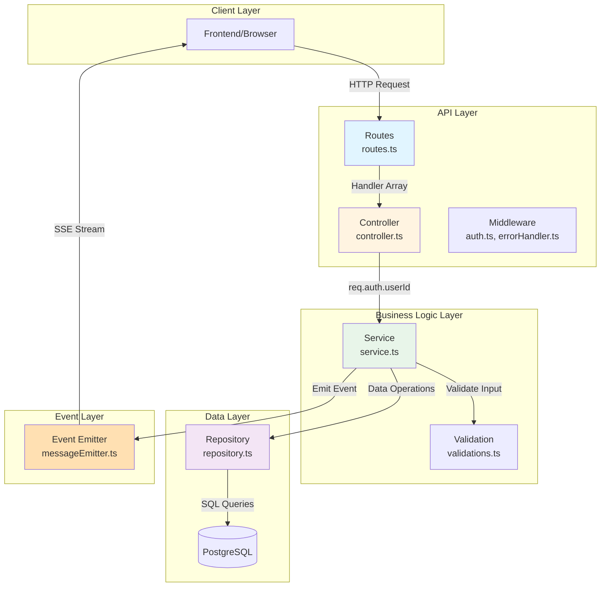
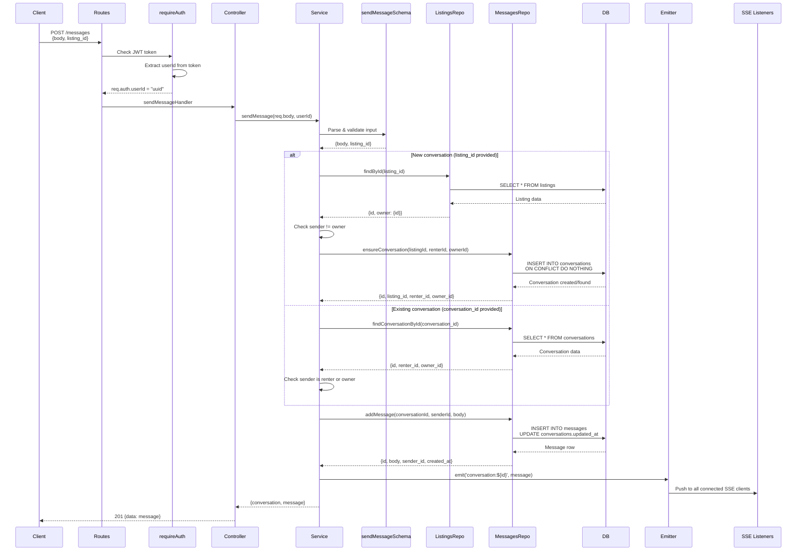
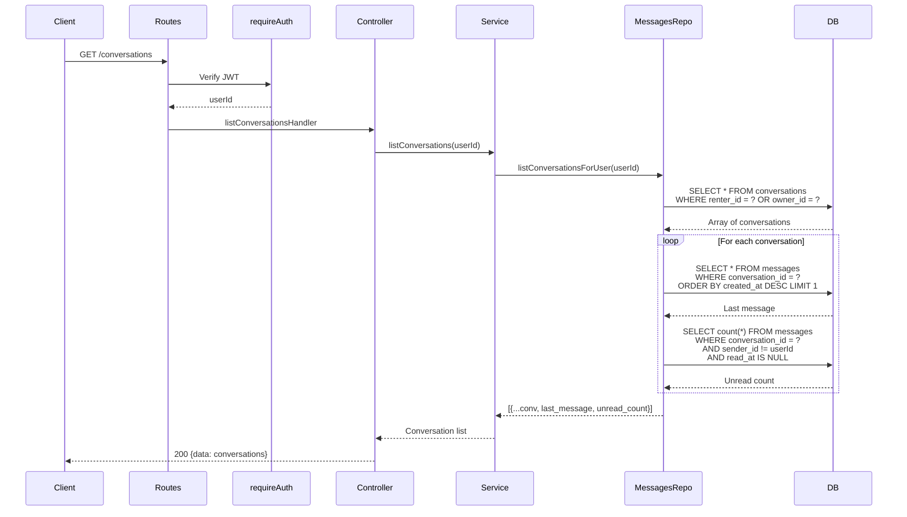
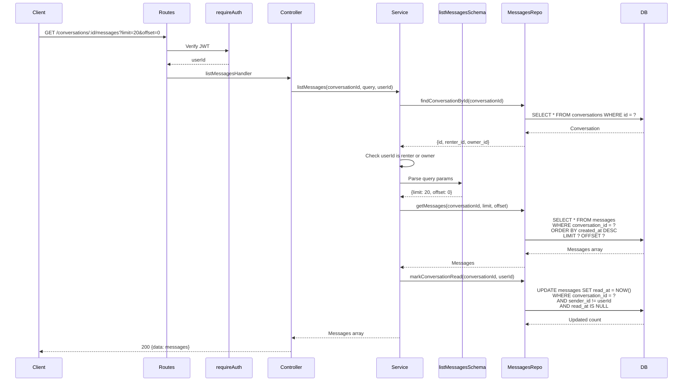
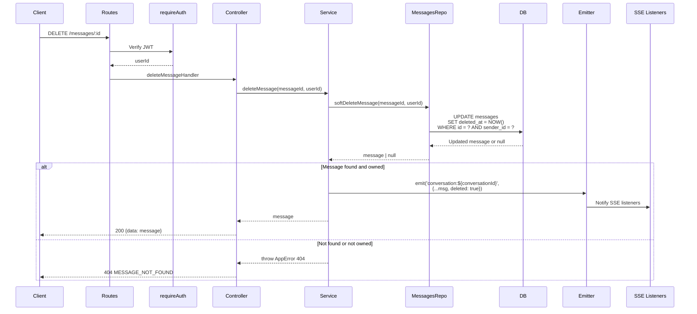
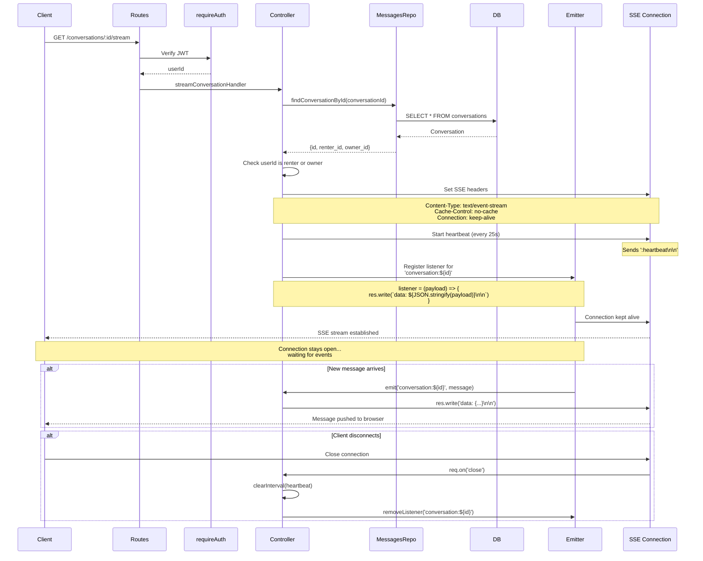
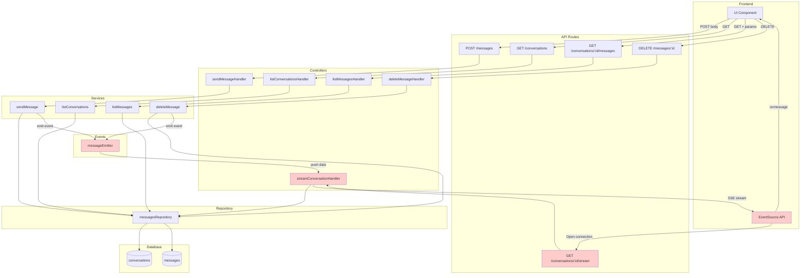
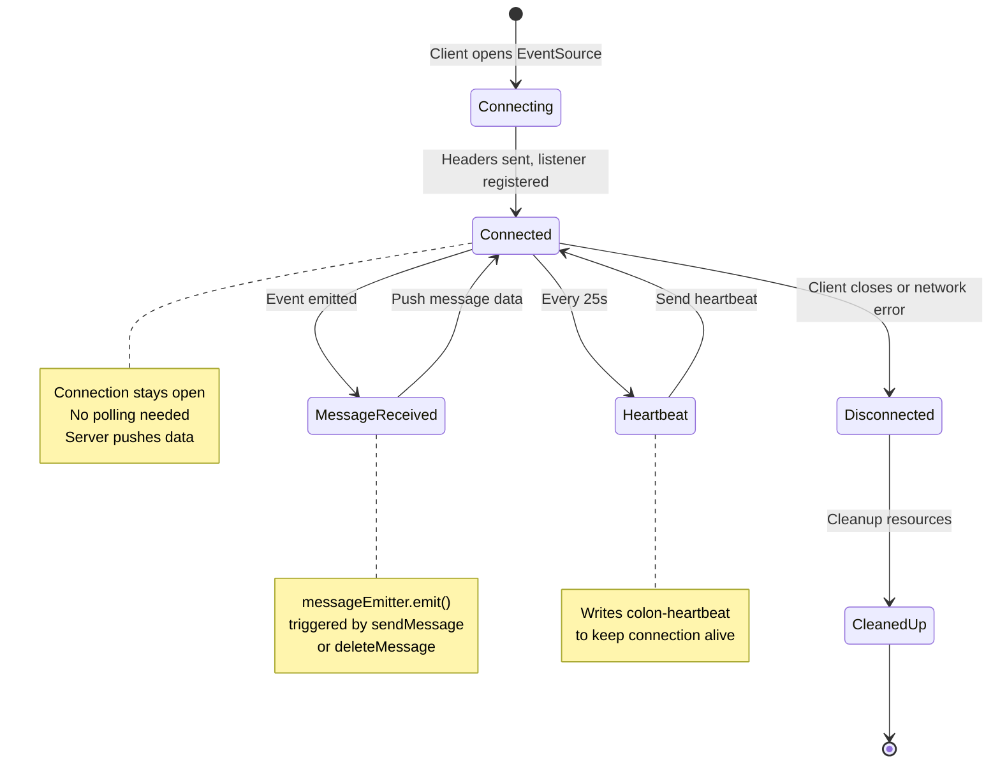

## Messaging Module Architecture

### Layer Responsibilities



**Layer Responsibilities:**

| Layer | File | Responsibility | Returns |
|-------|------|---------------|---------|
| **Routes** | routes.ts | Define endpoints, attach middleware, wire handlers | N/A |
| **Controller** | controller.ts | Extract request data, call service, format response | HTTP Response |
| **Service** | service.ts | Validate input, business logic, orchestrate operations | Domain data |
| **Repository** | `repository.ts` | Database queries, data persistence | Raw DB results |
| **Validation** | validations.ts | Zod schemas for input validation | Parsed & typed data |
| **Event Emitter** | `messageEmitter.ts` | Broadcast events to SSE listeners | N/A |

---

## Flow 1: Send Message (POST /messages)



**Function Signatures:**

```typescript
// Controller
sendMessageHandler: RequestHandler[]
  → asyncHandler(async (req: AuthenticatedRequest, res: Response))
  → calls sendMessage(req.body, req.auth!.userId)

// Service
sendMessage(payload: unknown, senderId: string)
  → validates with sendMessageSchema
  → returns {conversation, message}

// Repository
ensureConversation(listingId: string, renterId: string, ownerId: string)
  → INSERT INTO conversations with ON CONFLICT DO NOTHING
  → returns conversation object

addMessage(conversationId: string, senderId: string, body: string)
  → INSERT INTO messages
  → UPDATE conversations.updated_at
  → returns message object
```

---

## Flow 2: List Conversations (GET /conversations)



**Function Signatures:**

```typescript
// Controller
listConversationsHandler: RequestHandler[]
  → asyncHandler(async (req: AuthenticatedRequest, res: Response))
  → calls listConversations(req.auth!.userId)

// Service
listConversations(userId: string)
  → returns conversation array with metadata

// Repository
listConversationsForUser(userId: string)
  → SELECT conversations where user is renter or owner
  → For each: fetch last_message and unread_count
  → returns enriched conversation objects
```

---

## Flow 3: List Messages (GET /conversations/:id/messages)



**Function Signatures:**

```typescript
// Controller
listMessagesHandler: RequestHandler[]
  → extracts conversationId from req.params.id
  → calls listMessages(id, req.query, req.auth!.userId)

// Service
listMessages(conversationId: string, query: unknown, userId: string)
  → validates access to conversation
  → parses pagination params with listMessagesSchema
  → marks messages as read
  → returns message array

// Repository
getMessages(conversationId: string, limit: number, offset: number)
  → SELECT with pagination, newest first
  → returns message objects

markConversationRead(conversationId: string, userId: string)
  → UPDATE messages SET read_at for unread messages not sent by userId
```

---

## Flow 4: Delete Message (DELETE /messages/:id)



**Function Signatures:**

```typescript
// Controller
deleteMessageHandler: RequestHandler[]
  → extracts messageId from req.params.id
  → calls deleteMessage(id, req.auth!.userId)

// Service
deleteMessage(messageId: string, userId: string)
  → soft deletes message if owned by userId
  → emits deletion event
  → returns deleted message or throws

// Repository
softDeleteMessage(messageId: string, userId: string)
  → UPDATE messages SET deleted_at
  → WHERE id = ? AND sender_id = ? (ensures ownership)
  → returns updated row or null
```

---

## Flow 5: SSE Stream (GET /conversations/:id/stream) [[emitter and emit]]



**SSE Implementation Details:**

```typescript
// Controller
streamConversationHandler: RequestHandler[]
  → validates conversation access
  → sets SSE headers
  → establishes long-lived HTTP connection
  → registers event listener on messageEmitter
  → sends heartbeat every 25s to keep alive
  → cleans up on client disconnect

// Event Flow
1. res.setHeader('Content-Type', 'text/event-stream')
2. res.setHeader('Cache-Control', 'no-cache')
3. res.setHeader('Connection', 'keep-alive')
4. res.flushHeaders() // Send headers immediately

5. setInterval(() => res.write(':heartbeat\n\n'), 25000)
   // Prevents timeout, ignored by EventSource

6. messageEmitter.on(`conversation:${id}`, (payload) => {
     res.write(`data: ${JSON.stringify(payload)}\n\n`)
   })
   // Listens to events from sendMessage service

7. req.on('close', () => {
     clearInterval(heartbeat)
     messageEmitter.off(`conversation:${id}`, listener)
   })
   // Cleanup on disconnect
```

---

## Complete Data Flow Diagram



---

## SSE Connection Lifecycle



---

## Key Concepts

**Why SSE over Polling?**
- **Efficiency**: Single persistent connection vs repeated requests
- **Latency**: <500ms vs 5-10s (polling interval)
- **Battery**: Less network activity on mobile
- **Simplicity**: Built-in browser API, no library needed

**In-Memory Emitter Limitation:**
- Works only with **single server instance**
- For multi-instance: replace with Redis Pub/Sub
- EventEmitter broadcasts to all listeners on same process

**Auto-reconnection:**
- Browser EventSource automatically reconnects on disconnect
- Heartbeat prevents proxy/firewall timeouts
- Client should re-fetch missed messages on reconnect

**Message Flow Summary:**
1. **Send**: POST → Service validates → Repo saves → Emitter broadcasts → SSE pushes
2. **List Conversations**: GET → Repo joins last_message + unread_count → Return enriched data
3. **List Messages**: GET → Repo paginated query → Mark as read → Return messages
4. **Stream**: GET → Long-lived connection → Listen to emitter → Push events as they happen
5. **Delete**: DELETE → Soft delete → Emitter broadcasts deletion → SSE notifies clients