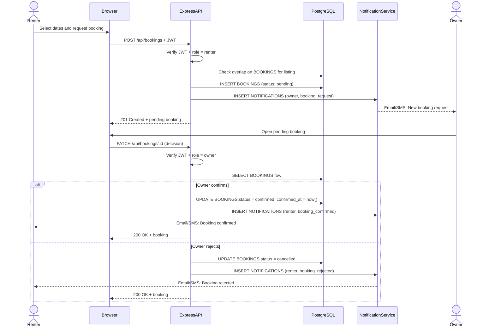

```mermaid
sequenceDiagram
    actor Renter
    participant Browser
    participant ExpressAPI
    participant PostgreSQL
    participant NotificationService
    actor Owner

    Renter->>Browser: Select dates and request booking
    Browser->>ExpressAPI: POST /api/bookings + JWT
    ExpressAPI->>ExpressAPI: Verify JWT + role = renter
    ExpressAPI->>PostgreSQL: Check overlap on BOOKINGS for listing
    ExpressAPI->>PostgreSQL: INSERT BOOKINGS (status: pending)
    ExpressAPI->>NotificationService: INSERT NOTIFICATIONS (owner, booking_request)
    NotificationService-->>Owner: Email/SMS: New booking request
    ExpressAPI-->>Browser: 201 Created + pending booking

    Owner->>Browser: Open pending booking
    Browser->>ExpressAPI: PATCH /api/bookings/:id (decision)
    ExpressAPI->>ExpressAPI: Verify JWT + role = owner
    ExpressAPI->>PostgreSQL: SELECT BOOKINGS row

    alt Owner confirms
        ExpressAPI->>PostgreSQL: UPDATE BOOKINGS.status = confirmed, confirmed_at = now()
        ExpressAPI->>NotificationService: INSERT NOTIFICATIONS (renter, booking_confirmed)
        NotificationService-->>Renter: Email/SMS: Booking confirmed
        ExpressAPI-->>Browser: 200 OK + booking
    else Owner rejects
        ExpressAPI->>PostgreSQL: UPDATE BOOKINGS.status = cancelled
        ExpressAPI->>NotificationService: INSERT NOTIFICATIONS (renter, booking_rejected)
        NotificationService-->>Renter: Email/SMS: Booking rejected
        ExpressAPI-->>Browser: 200 OK + booking
    end
```