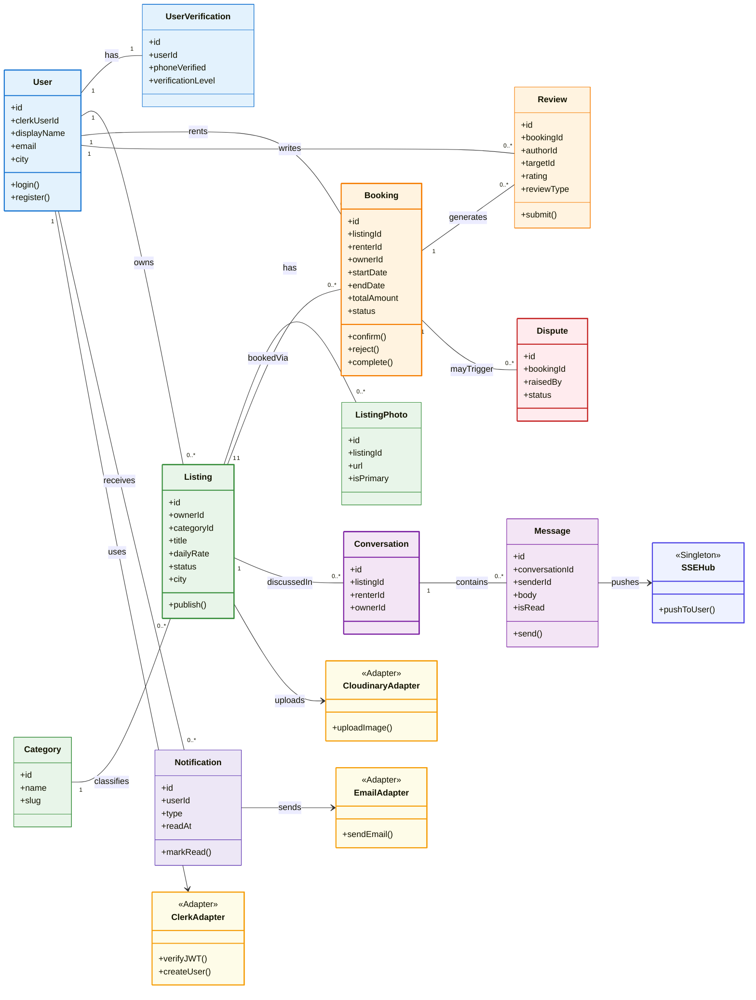

```mermaid
classDiagram
direction LR

%% ----------------- Entities -----------------
class User {
    +id
    +clerkUserId
    +displayName
    +email
    +city
    +login()
    +register()
}
class UserVerification {
    +id
    +userId
    +phoneVerified
    +verificationLevel
}
class Listing {
    +id
    +ownerId
    +categoryId
    +title
    +dailyRate
    +status
    +city
    +publish()
}
class Category {
    +id
    +name
    +slug
}
class ListingPhoto {
    +id
    +listingId
    +url
    +isPrimary
}
class Booking {
    +id
    +listingId
    +renterId
    +ownerId
    +startDate
    +endDate
    +totalAmount
    +status
    +confirm()
    +reject()
    +complete()
}
class Review {
    +id
    +bookingId
    +authorId
    +targetId
    +rating
    +reviewType
    +submit()
}
class Conversation {
    +id
    +listingId
    +renterId
    +ownerId
}
class Message {
    +id
    +conversationId
    +senderId
    +body
    +isRead
    +send()
}
class Dispute {
    +id
    +bookingId
    +raisedBy
    +status
}
class Notification {
    +id
    +userId
    +type
    +readAt
    +markRead()
}

%% ----------------- Design Patterns -----------------
class SSEHub {
    <<Singleton>>
    +pushToUser()
}
class ClerkAdapter {
    <<Adapter>>
    +verifyJWT()
    +createUser()
}
class CloudinaryAdapter {
    <<Adapter>>
    +uploadImage()
}
class EmailAdapter {
    <<Adapter>>
    +sendEmail()
}

%% ----------------- Relationships -----------------
User "1" -- "1" UserVerification : has
User "1" -- "0..*" Listing : owns
Category "1" -- "0..*" Listing : classifies
Listing "1" -- "0..*" ListingPhoto : has
Listing "1" -- "0..*" Booking : bookedVia
User "1" -- "0..*" Booking : rents
Booking "1" -- "0..*" Review : generates
User "1" -- "0..*" Review : writes
Listing "1" -- "0..*" Conversation : discussedIn
Conversation "1" -- "0..*" Message : contains
Booking "1" -- "0..*" Dispute : mayTrigger
User "1" -- "0..*" Notification : receives

%% ----------------- Dependencies -----------------
User --> ClerkAdapter : uses
Listing --> CloudinaryAdapter : uploads
Notification --> EmailAdapter : sends
Message --> SSEHub : pushes

%% ----------------- Styling -----------------
style User fill:#e3f2fd,stroke:#1976d2,stroke-width:2px
style UserVerification fill:#e3f2fd,stroke:#1976d2,stroke-width:1px
style Listing fill:#e8f5e9,stroke:#388e3c,stroke-width:2px
style Category fill:#e8f5e9,stroke:#388e3c,stroke-width:1px
style ListingPhoto fill:#e8f5e9,stroke:#388e3c,stroke-width:1px
style Booking fill:#fff3e0,stroke:#f57c00,stroke-width:2px
style Review fill:#fff3e0,stroke:#f57c00,stroke-width:1px
style Conversation fill:#f3e5f5,stroke:#7b1fa2,stroke-width:2px
style Message fill:#f3e5f5,stroke:#7b1fa2,stroke-width:1px
style Dispute fill:#ffebee,stroke:#c62828,stroke-width:2px
style Notification fill:#ede7f6,stroke:#5e35b1,stroke-width:1px
style SSEHub fill:#eef2ff,stroke:#4f46e5,stroke-width:2px
style ClerkAdapter fill:#fefce8,stroke:#f59e0b,stroke-width:2px
style CloudinaryAdapter fill:#fefce8,stroke:#f59e0b,stroke-width:2px
style EmailAdapter fill:#fefce8,stroke:#f59e0b,stroke-width:2px
```