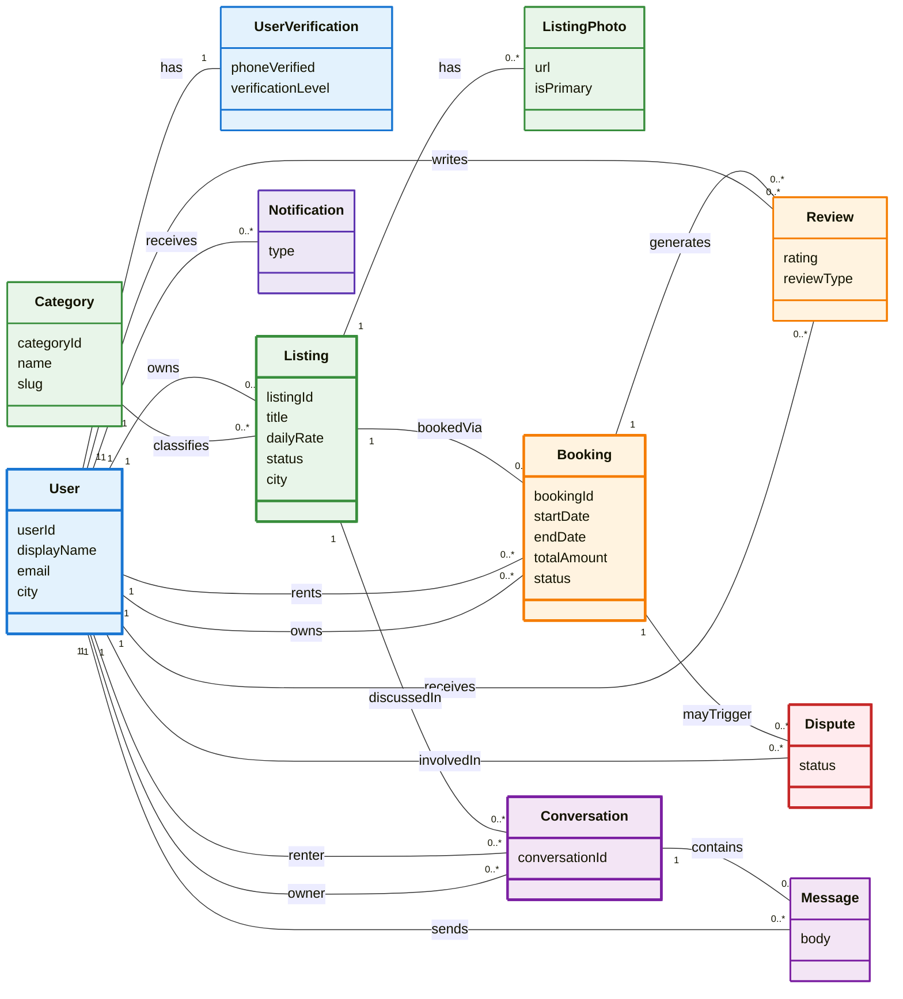

```mermaid
---

config:

theme: default

themeVariables:

fontSize: 18px

fontFamily: ''

layout: dagre

---

classDiagram

direction LR

  

class User {

userId

displayName

email

city

}

  

class UserVerification {

phoneVerified

verificationLevel

}

  

class Listing {

listingId

title

dailyRate

status

city

}

  

class Category {

categoryId

name

slug

}

  

class ListingPhoto {

url

isPrimary

}

  

class Booking {

bookingId

startDate

endDate

totalAmount

status

}

  

class Review {

rating

reviewType

}

  

class Conversation {

conversationId

}

  

class Message {

body

}

  

class Dispute {

status

}

  

class Notification {

type

}

  

User "1" -- "1" UserVerification : has

  

User "1" -- "0..*" Listing : owns

Category "1" -- "0..*" Listing : classifies

  

Listing "1" -- "0..*" ListingPhoto : has

  

Listing "1" -- "0..*" Booking : bookedVia

User "1" -- "0..*" Booking : rents

User "1" -- "0..*" Booking : owns

  

Booking "1" -- "0..*" Review : generates

User "1" -- "0..*" Review : writes

User "1" -- "0..*" Review : receives

  

Listing "1" -- "0..*" Conversation : discussedIn

User "1" -- "0..*" Conversation : renter

User "1" -- "0..*" Conversation : owner

  

Conversation "1" -- "0..*" Message : contains

User "1" -- "0..*" Message : sends

  

Booking "1" -- "0..*" Dispute : mayTrigger

User "1" -- "0..*" Dispute : involvedIn

  

User "1" -- "0..*" Notification : receives

  

style User fill:#e3f2fd,stroke:#1976d2,stroke-width:3px

style UserVerification fill:#e3f2fd,stroke:#1976d2,stroke-width:2px

  

style Listing fill:#e8f5e9,stroke:#388e3c,stroke-width:3px

style Category fill:#e8f5e9,stroke:#388e3c,stroke-width:2px

style ListingPhoto fill:#e8f5e9,stroke:#388e3c,stroke-width:2px

  

style Booking fill:#fff3e0,stroke:#f57c00,stroke-width:3px

style Review fill:#fff3e0,stroke:#f57c00,stroke-width:2px

style Dispute fill:#ffebee,stroke:#c62828,stroke-width:3px

  

style Conversation fill:#f3e5f5,stroke:#7b1fa2,stroke-width:3px

style Message fill:#f3e5f5,stroke:#7b1fa2,stroke-width:2px

  

style Notification fill:#ede7f6,stroke:#5e35b1,stroke-width:2px
```