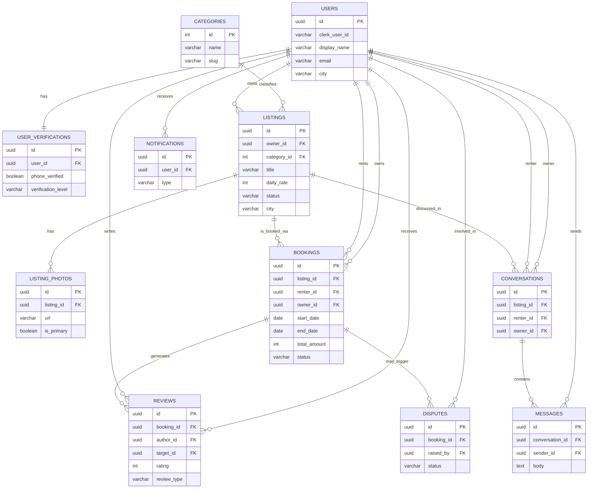

```mermaid
---

config:

layout: elk

theme: redux-color

themeVariables:

fontSize: 18px

---

erDiagram

  

USERS ||--|| USER_VERIFICATIONS : has

USERS ||--o{ LISTINGS : owns

CATEGORIES ||--o{ LISTINGS : classifies

LISTINGS ||--o{ LISTING_PHOTOS : has

LISTINGS ||--o{ BOOKINGS : is_booked_via

USERS ||--o{ BOOKINGS : rents

USERS ||--o{ BOOKINGS : owns

BOOKINGS ||--o{ REVIEWS : generates

USERS ||--o{ REVIEWS : writes

USERS ||--o{ REVIEWS : receives

LISTINGS ||--o{ CONVERSATIONS : discussed_in

USERS ||--o{ CONVERSATIONS : renter

USERS ||--o{ CONVERSATIONS : owner

CONVERSATIONS ||--o{ MESSAGES : contains

USERS ||--o{ MESSAGES : sends

BOOKINGS ||--o{ DISPUTES : may_trigger

USERS ||--o{ DISPUTES : involved_in

USERS ||--o{ NOTIFICATIONS : receives

  

USERS {

uuid id PK

varchar clerk_user_id

varchar display_name

varchar email

varchar city

}

  

USER_VERIFICATIONS {

uuid id PK

uuid user_id FK

boolean phone_verified

varchar verification_level

}

  

CATEGORIES {

int id PK

varchar name

varchar slug

}

  

LISTINGS {

uuid id PK

uuid owner_id FK

int category_id FK

varchar title

int daily_rate

varchar status

varchar city

}

  

LISTING_PHOTOS {

uuid id PK

uuid listing_id FK

varchar url

boolean is_primary

}

  

BOOKINGS {

uuid id PK

uuid listing_id FK

uuid renter_id FK

uuid owner_id FK

date start_date

date end_date

int total_amount

varchar status

}

  

REVIEWS {

uuid id PK

uuid booking_id FK

uuid author_id FK

uuid target_id FK

int rating

varchar review_type

}

  

CONVERSATIONS {

uuid id PK

uuid listing_id FK

uuid renter_id FK

uuid owner_id FK

}

  

MESSAGES {

uuid id PK

uuid conversation_id FK

uuid sender_id FK

text body

}

  

DISPUTES {

uuid id PK

uuid booking_id FK

uuid raised_by FK

varchar status

}

  

NOTIFICATIONS {

uuid id PK

uuid user_id FK

varchar type

}
```