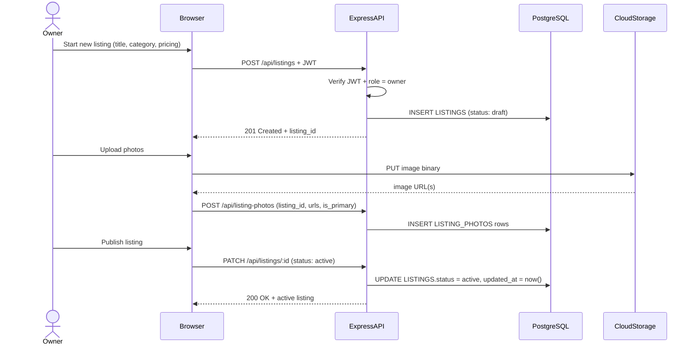

```mermaid
sequenceDiagram
    actor Owner
    participant Browser
    participant ExpressAPI
    participant PostgreSQL
    participant CloudStorage

    Owner->>Browser: Start new listing (title, category, pricing)
    Browser->>ExpressAPI: POST /api/listings + JWT
    ExpressAPI->>ExpressAPI: Verify JWT + role = owner
    ExpressAPI->>PostgreSQL: INSERT LISTINGS (status: draft)
    ExpressAPI-->>Browser: 201 Created + listing_id

    Owner->>Browser: Upload photos
    Browser->>CloudStorage: PUT image binary
    CloudStorage-->>Browser: image URL(s)
    Browser->>ExpressAPI: POST /api/listing-photos (listing_id, urls, is_primary)
    ExpressAPI->>PostgreSQL: INSERT LISTING_PHOTOS rows

    Owner->>Browser: Publish listing
    Browser->>ExpressAPI: PATCH /api/listings/:id (status: active)
    ExpressAPI->>PostgreSQL: UPDATE LISTINGS.status = active, updated_at = now()
    ExpressAPI-->>Browser: 200 OK + active listing
```