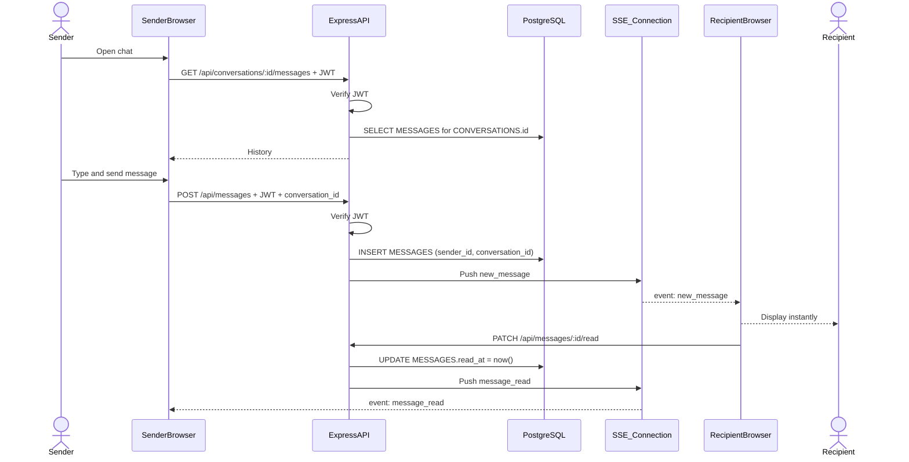

```mermaid
sequenceDiagram
    actor Sender
    participant SenderBrowser
    participant ExpressAPI
    participant PostgreSQL
    participant SSE_Connection
    participant RecipientBrowser
    actor Recipient

    Sender->>SenderBrowser: Open chat
    SenderBrowser->>ExpressAPI: GET /api/conversations/:id/messages + JWT
    ExpressAPI->>ExpressAPI: Verify JWT
    ExpressAPI->>PostgreSQL: SELECT MESSAGES for CONVERSATIONS.id
    ExpressAPI-->>SenderBrowser: History

    Sender->>SenderBrowser: Type and send message
    SenderBrowser->>ExpressAPI: POST /api/messages + JWT + conversation_id
    ExpressAPI->>ExpressAPI: Verify JWT
    ExpressAPI->>PostgreSQL: INSERT MESSAGES (sender_id, conversation_id)
    ExpressAPI->>SSE_Connection: Push new_message
    SSE_Connection-->>RecipientBrowser: event: new_message
    RecipientBrowser-->>Recipient: Display instantly

    RecipientBrowser->>ExpressAPI: PATCH /api/messages/:id/read
    ExpressAPI->>PostgreSQL: UPDATE MESSAGES.read_at = now()
    ExpressAPI->>SSE_Connection: Push message_read
    SSE_Connection-->>SenderBrowser: event: message_read
```
