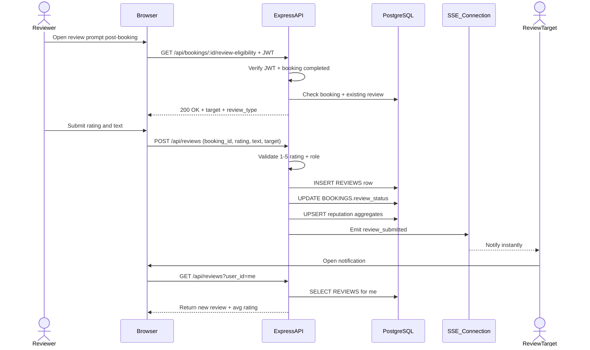

```mermaid
sequenceDiagram
    actor Reviewer
    participant Browser
    participant ExpressAPI
    participant PostgreSQL
    participant SSE_Connection
    actor ReviewTarget

    Reviewer->>Browser: Open review prompt post-booking
    Browser->>ExpressAPI: GET /api/bookings/:id/review-eligibility + JWT
    ExpressAPI->>ExpressAPI: Verify JWT + booking completed
    ExpressAPI->>PostgreSQL: Check booking + existing review
    ExpressAPI-->>Browser: 200 OK + target + review_type

    Reviewer->>Browser: Submit rating and text
    Browser->>ExpressAPI: POST /api/reviews (booking_id, rating, text, target)
    ExpressAPI->>ExpressAPI: Validate 1-5 rating + role
    ExpressAPI->>PostgreSQL: INSERT REVIEWS row
    ExpressAPI->>PostgreSQL: UPDATE BOOKINGS.review_status

    ExpressAPI->>PostgreSQL: UPSERT reputation aggregates
    ExpressAPI->>SSE_Connection: Emit review_submitted
    SSE_Connection-->>ReviewTarget: Notify instantly

    ReviewTarget->>Browser: Open notification
    Browser->>ExpressAPI: GET /api/reviews?user_id=me
    ExpressAPI->>PostgreSQL: SELECT REVIEWS for me
    ExpressAPI-->>Browser: Return new review + avg rating
```
