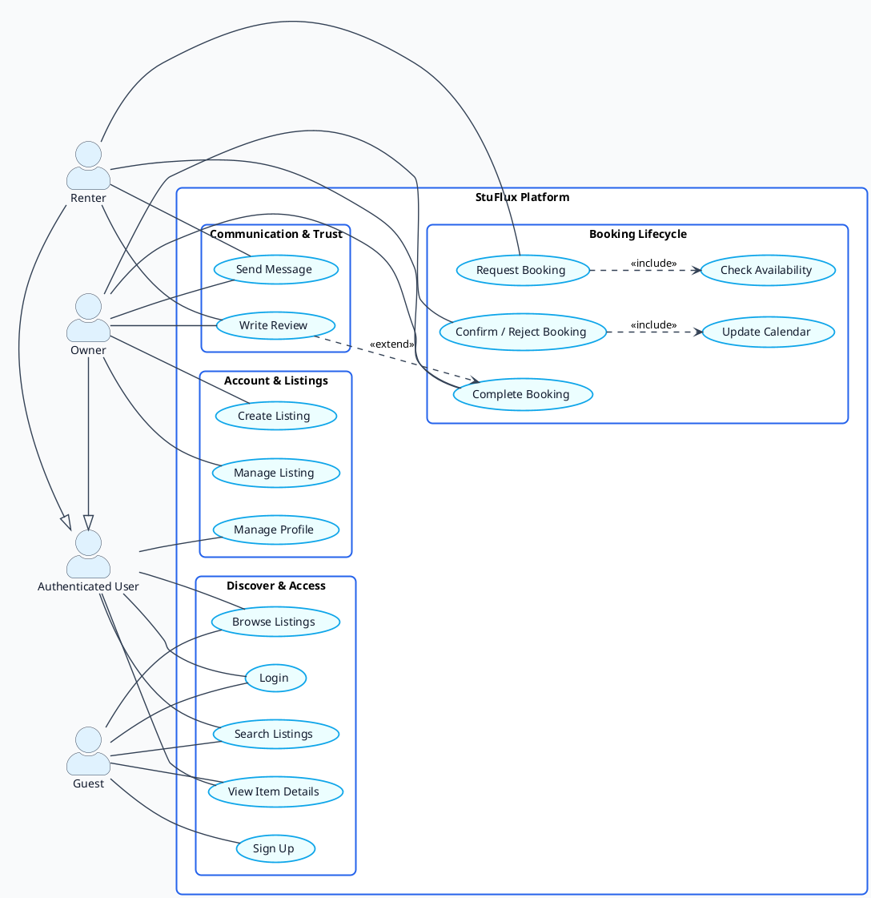

```plantuml
@startuml
left to right direction

' ---------- GLOBAL STYLE ----------
skinparam backgroundColor #f9fafb
skinparam shadowing false
skinparam defaultTextAlignment center

skinparam ArrowColor #334155
skinparam ArrowThickness 1.4

skinparam actorStyle awesome
skinparam actorBorderColor #334155
skinparam actorBackgroundColor #e0f2fe
skinparam actorFontColor #0f172a

skinparam rectangleBorderColor #2563eb
skinparam rectangleBackgroundColor #ffffff
skinparam rectangleBorderThickness 2
skinparam rectangleRoundCorner 14

skinparam usecaseBorderColor #0ea5e9
skinparam usecaseBackgroundColor #ecfeff
skinparam usecaseFontColor #0f172a
skinparam usecaseBorderThickness 1.8
skinparam usecaseRoundCorner 16

' ---------- ACTORS (LEFT) ----------
actor Guest
actor "Authenticated User" as AuthUser

' ---------- SYSTEM BOUNDARY ----------
rectangle "StuFlux Platform" {

    rectangle "Discover & Access" {
        usecase "Browse Listings" as UC_Browse
        usecase "Search Listings" as UC_Search
        usecase "View Item Details" as UC_View
        usecase "Sign Up" as UC_SignUp
        usecase "Login" as UC_Login
    }

    rectangle "Account & Listings" {
        usecase "Manage Profile" as UC_ManageProfile
        usecase "Create Listing" as UC_CreateListing
        usecase "Manage Listing" as UC_ManageListing
    }

    rectangle "Booking Lifecycle" {
        usecase "Request Booking" as UC_RequestBooking
        usecase "Check Availability" as UC_CheckAvail
        usecase "Confirm / Reject Booking" as UC_ConfirmReject
        usecase "Update Calendar" as UC_UpdateCalendar
        usecase "Complete Booking" as UC_CompleteBooking
    }

    rectangle "Communication & Trust" {
        usecase "Send Message" as UC_SendMessage
        usecase "Write Review" as UC_WriteReview
    }
}

' ---------- ACTORS (RIGHT) ----------
actor Renter
actor Owner

' ---------- ASSOCIATIONS ----------
Guest -- UC_Browse
Guest -- UC_Search
Guest -- UC_View
Guest -- UC_SignUp
Guest -- UC_Login

AuthUser -- UC_Browse
AuthUser -- UC_Search
AuthUser -- UC_View
AuthUser -- UC_Login
AuthUser -- UC_ManageProfile

Renter -- UC_RequestBooking
Renter -- UC_SendMessage
Renter -- UC_WriteReview
Renter -- UC_CompleteBooking

Owner -- UC_CreateListing
Owner -- UC_ManageListing
Owner -- UC_ConfirmReject
Owner -- UC_SendMessage
Owner -- UC_WriteReview
Owner -- UC_CompleteBooking

' ---------- GENERALIZATION ----------
Renter -|> AuthUser
Owner -|> AuthUser

' ---------- USE CASE RELATIONSHIPS ----------
UC_RequestBooking ..> UC_CheckAvail : <<include>>
UC_ConfirmReject ..> UC_UpdateCalendar : <<include>>
UC_WriteReview ..> UC_CompleteBooking : <<extend>>

@enduml

```