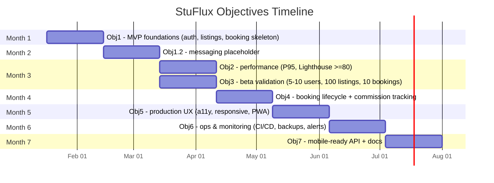

## Government Queen Mary College, Lahore  
University of the Punjab, Lahore  
Final Year Project Proposal

### Contents
1. Project Title  
2. Project Overview Statement  
3. Project Goals and Objectives  
4. High-Level System Components  
5. List of Optional Functional Units  
6. Exclusions  
7. Application Architecture  
8. Gantt Chart  
9. Hardware and Software Specification  
10. Tools and Technologies

### 1. Project Title
StuFlux: Peer-to-Peer Rental Marketplace

### 2. Project Overview Statement
**Project Supervisor:** Miss Rida  

**Project Members:**

| Roll No. | Name             | Email                       | Signature   |
| -------- | ---------------- | --------------------------- | ----------- |
| 093080   | Hajra Mubasher   | hajramubasher8110@gmail.com | ___________ |
| 093078   | Wajeeha Shahzaib | wajeehashahzeb56@gmail.com  | ___________ |

**Project Goal:**  
To develop and deploy a scalable, performant peer-to-peer rental marketplace that enables users to monetize underutilized assets and access affordable short-term rentals through a trusted platform with secure authentication, real-time communication, and transparent booking workflows.

**Project Success Criteria:**  
1. Functional Requirements: Complete implementation of authentication (Clerk), listing CRUD operations, booking lifecycle (pending/confirmed/completed), real-time messaging, and two-way review system.
2. Performance Metrics: Achieve <300ms response time for listing reads, <3s for booking creation, ≥80 Lighthouse score on all pages.
3. Deployment: Successfully deploy on free/low-cost infrastructure (Vercel + Railway/Fly.io + Neon) with operational costs under $15/month.
4. User Validation: Onboard 5-10 beta users with 100+ test listings demonstrating end-to-end rental workflows.
5. Security: Implement Row-Level Security (RLS) in PostgreSQL, secure JWT validation, and input sanitization across all endpoints.

**Assumptions:**  
- Users have access to smartphones/computers with modern browsers
- Internet connectivity available for real-time features
- Users willing to conduct cash transactions in-person during MVP phase
- Cloud service free tiers remain available (Vercel, Neon, Cloudinary)

**Risks and Mitigation:**  
- **Payment Infrastructure:** Stripe unavailable in Pakistan → Manual cash transactions with commission tracking; future migration path planned
- **Free-Tier Limits:** Railway/Neon resource constraints → Monitor usage metrics; prepared to migrate to Fly.io ($5-10/month)
- **Real-Time Performance:** SSE may have limitations → Designed with upgrade path to WebSocket/Socket.io
- **Team Capacity:** Two-member team → Pair programming approach with rotating roles; feature prioritization
- **Commission Collection:** Trust-based manual system → Implement blocking mechanism for non-payment; start with trusted user network

**Obstacles:**  
- Learning curve for  hybrid architecture
- Coordinating Next.js SSR with Express API authentication
- Implementing reliable SSE with connection management
- Database query optimization for shared access pattern

**Organization Address (if applicable):** N/A  
**Project Type:** ☑ Development ☐ Research  
**Target End Users:** Students, young professionals, and individuals in urban areas seeking affordable access to infrequently-used items (cameras, tools, party equipment, sports gear) without the burden of ownership costs.  
**Development Technology:** ☑ Object Oriented ☐ Structured  
**Platform:** ☑ Web based ☐ Distributed ☐ Desktop based ☐ Setup Configurations  
**Approved By / Date:** _______________________

**Comparison with Existing Platforms:**

| Aspect         | OLX/Daraz                | Get Gaari/Rent Hives              | StuFlux                                    |
| -------------- | ------------------------ | --------------------------------- | ------------------------------------------ |
| **Model**      | Sell, ownership transfer | Rent, niche categories            | Rent, multi-category                       |
| **Categories** | All (selling)            | Single: vehicles/fashion/services | Multi: electronics, tools, events, sports  |
| **Real-Time**  | Not needed               | Manual vetting, delays            | WebSocket messaging, instant notifications |
| **Trust**      | Seller ratings           | Basic ratings, manual verify      | Two-way reviews, JWT security, RLS         |
| **Payment**    | Direct payment           | Basic gateways                    | Auto commission tracking, future escrow    |
| **Coverage**   | Nationwide               | Urban (Lahore, Karachi)           | Scalable city-by-city expansion            |
| **Analytics**  | Seller insights          | Minimal                           | Booking trends                             |
| **Access**     | Web + mobile             | Mobile-focused                    | Web-first PWA, future native mobile        |
| **Revenue**    | Listing fees, ads        | Commission on rentals             | 10-15% commission, future subscriptions    |

**Gap Addressed:** OLX/Daraz enable selling but not temporary use. Existing rentals (Get Gaari, Rent Hives, KirayePer) are fragmented by category. StuFlux unifies multi-category rentals with modern architecture, real-time features, and scalable infrastructure.

### 3. Project Goals and Objectives

**Goals (Broad Strategic Outcomes):**

1. **Marketplace Efficiency:** Enable efficient discovery and utilization of underutilized assets through intuitive browsing, search, and filtering capabilities with sub-second response times.

2. **Trust and Safety:** Establish a reliable transaction environment through secure authentication, owner-controlled approval workflows, comprehensive audit trails, and bidirectional reputation systems.

3. **User Engagement:** Facilitate seamless communication between renters and owners through real-time messaging infrastructure with delivery guarantees and notification systems.

4. **Scalable Foundation:** Build a cost-effective, maintainable architecture capable of supporting future enhancements including mobile applications, payment integration, and advanced analytics.

**Objectives (SMART - Specific, Measurable, Achievable, Realistic, Time-bound):**

| Sr. # | Objective | Success Metric | Timeline |
|-------|-----------|----------------|----------|
| 1 | Develop and deploy MVP web application with core features (authentication, listings, booking requests, SSE messaging) | All features functional with zero critical bugs; accessible via public URL | Month 2 (Week 8) |
| 2 | Optimize system performance for production readiness | API P95 latency <500ms for reads, <3s for writes; Lighthouse score ≥80; zero security vulnerabilities in automated scans | Month 3 (Week 12) |
| 3 | Validate marketplace concept with real users | Successfully onboard 5-10 beta testers; 100+ test listings created; minimum 10 completed booking cycles | Month 3 (Week 12) |
| 4 | Implement complete booking lifecycle with financial tracking | Pending/confirmed/completed status transitions functional; commission calculation and tracking operational; email notifications sent | Month 4 (Week 16) |
| 5 | Achieve production-quality user experience | Accessibility score ≥80 (WCAG 2.1 AA compliance); mobile-responsive design verified on 3+ devices; PWA installable | Month 5 (Week 20) |
| 6 | Establish operational infrastructure with monitoring | CI/CD pipeline operational; error tracking configured; database backups automated; uptime monitoring active | Month 6 (Week 24) |
| 7 | Prepare foundation for Phase 2 (mobile apps) | API documentation complete; mobile-ready endpoints tested; authentication flow compatible with React Native | Month 7 (Week 28) |

### 4. High-Level System Components

The system follows a hybrid architecture with clear separation of concerns:

**A. Inputs (User-Generated Data):**
- User credentials (email, OAuth tokens) for authentication
- Listing information (title, description, category, pricing, location, specifications)
- Image files (JPEG/PNG, max 5 per listing, client-side compressed before upload)
- Booking requests (date ranges, item selections, user preferences)
- Messages (text content, sender/recipient identifiers, timestamps)
- Reviews (star ratings 1-5, text feedback, booking references)

**B. Outputs (System-Generated Data):**
- Listing feeds (paginated, filtered, sorted by relevance/date)
- Booking status updates (pending/confirmed/rejected/completed with timestamps)
- Real-time notifications (in-app via SSE, email via transactional service)
- Commission receipts and invoices (PDF generation for owners)
- Analytics dashboards (booking trends, revenue metrics, user activity)
- Audit logs (all state-changing operations with user attribution)

**C. Core Processes (Business Logic):**
1. **Authentication & Authorization:** Clerk-based JWT validation, role-based access control (RBAC), session management
2. **Listing Management:** CRUD operations, image optimization, search indexing, status workflows (draft/active/inactive)
3. **Booking Workflows:** Availability validation, conflict detection, status transitions with owner approval, date blocking
4. **Real-Time Messaging:** SSE connection management, message persistence, delivery confirmation, online/offline status
5. **Commission Tracking:** Automatic calculation (10-15% of rental fee), invoice generation, payment status tracking
6. **Review System:** Post-booking review submission, bidirectional visibility control, aggregate rating calculation
7. **Notification Engine:** Event-driven notifications (new booking, message received, booking confirmed), multi-channel delivery

**D. Stored Data (Database Schema):**
- **Users:** clerk_id (FK), email, name, profile_photo, created_at, role
- **Listings:** owner_id (FK), title, description, category, daily_rate, location, photos (JSONB URLs), status, specifications (JSONB)
- **Bookings:** listing_id (FK), renter_id (FK), owner_id (FK), start_date, end_date, total_price, commission, status, created_at
- **Messages:** conversation_id, sender_id (FK), recipient_id (FK), content, read_at, created_at
- **Reviews:** booking_id (FK), reviewer_id (FK), reviewee_id (FK), rating, comment, created_at
- **Notifications:** user_id (FK), type, content, read_at, created_at
- **Blocked_Dates:** listing_id (FK), start_date, end_date, reason (booking/owner-blocked)

**E. Component Interactions (Data Flow):**

```
┌─────────────────────────────────────────────────────────┐
│                  CLIENT (Browser)                       │
│  ┌──────────────┐         ┌─────────────────────────┐   │
│  │ Next.js UI   │◄────────┤  SSE Event Stream       │   │
│  │ (React)      │         │  (Real-time updates)    │   │
│  └───────┬──────┘         └─────────────────────────┘   │
└──────────┼──────────────────────────────────────────────┘
       │
       │ API Calls (REST)
       │
  ┌──────▼───────────────────────────────────┐
  │        ROUTING LAYER                     │
  │  ┌────────────┐      ┌────────────────┐ │
  │  │ Next.js    │      │  Express API   │ │
  │  │ Server     │      │  (Business     │ │
  │  │ Components │      │   Logic)       │ │
  │  │ (Reads)    │      │  (Writes)      │ │
  │  └─────┬──────┘      └────────┬───────┘ │
  └────────┼─────────────────────┼──────────┘
       │                     │
       │ Direct Queries      │ Transactions
       │                     │
  ┌────────▼─────────────────────▼──────────┐
  │      PostgreSQL (Neon.tech)             │
  │  ┌──────────────────────────────────┐   │
  │  │  Tables + Row-Level Security     │   │
  │  │  (RLS Policies per User)         │   │
  │  └──────────────────────────────────┘   │
  └─────────────────────────────────────────┘
       ▲                     ▲
       │                     │
  ┌────────┴──────┐     ┌───────┴─────────┐
  │  Clerk Auth   │     │  Cloudinary     │
  │  (JWT tokens) │     │  (Images)       │
  └───────────────┘     └─────────────────┘
```

**Interaction Pattern:**
- **Read Operations (80% traffic):** Browser → Next.js Server Components → PostgreSQL → Cached Response
- **Write Operations (20% traffic):** Browser → Express API → Business Logic → PostgreSQL Transaction → Response
- **Real-Time Updates:** Express SSE Endpoint → Client Event Listener → UI Update

### 5. List of Optional Functional Units
- Push notifications and WebSocket upgrade for messaging.  
- Stripe escrow when available in Pakistan.  
- Advanced analytics dashboard and admin panel.  
- ID/CNIC verification and SMS verification for owners.  
- PWA offline caching and installability.

### 6. Exclusions
- Online payments/escrow in Pakistan.  
- Insurance/damage protection.  
- Native mobile apps (planned after web MVP).  
- Nested categories (kept flat for MVP).

### 7. Application Architecture

**Architecture Type:** Three-Tier Hybrid Architecture

The system implements a hybrid three-tier architecture that optimally distributes workload based on operation characteristics:

**Tier 1 - Presentation Layer (Next.js 14 App Router):**
- **Technology:** React Server Components + Client Components
- **Responsibilities:** UI rendering, client-side state management, form validation, image compression
- **Hosting:** Vercel Edge Network (free tier, global CDN)
- **Optimization:** Server-Side Rendering (SSR), Incremental Static Regeneration (ISR, 60s revalidation), code splitting

**Tier 2 - Application Layer (Dual Backend):**

*2a. Next.js Server (Read-Heavy Operations):*
- **Handles:** Listing browsing, search, view details, user profiles (public data)
- **Pattern:** Direct PostgreSQL queries via Drizzle ORM
- **Caching:** Edge caching, ISR for semi-static content
- **Rationale:** Minimizes latency for 80% of traffic (browse operations), zero cost

*2b. Express.js API (Write-Heavy & Complex Operations):*
- **Handles:** Bookings, messaging, notifications, listing creation/updates, reviews
- **Pattern:** Business logic → Validation → Database transactions → Side effects (emails, notifications)
- **Hosting:** Railway (Months 1-4, free tier) → Fly.io (Month 5+, $5-10/month, better latency)
- **Rationale:** Full control over complex workflows, transaction support, mobile app compatibility

**Tier 3 - Data Layer (PostgreSQL with RLS):**
- **Database:** Neon.tech managed PostgreSQL (free 3GB tier, serverless)
- **Access Pattern:** Both Next.js AND Express connect directly via connection pooling
- **Security:** Row-Level Security (RLS) policies enforce user-specific data access
- **Backup:** Automated daily snapshots, point-in-time recovery

**Real-Time Communication:**
- **Initial Implementation:** Server-Sent Events (SSE)
  - Rationale: Simpler than WebSockets, better compatibility with serverless/Railway free tier
  - Pattern: Long-lived HTTP connection, unidirectional server→client push
  - Limitations: Browser connection limits (6 per domain), no true bidirectional
- **Upgrade Path:** WebSocket/Socket.io (Month 5+ when migrating to Fly.io)
  - Trigger: User demand for typing indicators, voice notes, or connection limits reached

**External Services Integration:**
- **Authentication:** Clerk (JWT-based, works with both Next.js & Express)
- **File Storage:** Cloudinary (direct browser upload with signed URLs, automatic optimization)
- **Email:** Transactional email service (Resend/SendGrid) for notifications
- **Monitoring:** Vercel Analytics (frontend), error tracking (Sentry), uptime monitoring

**Architectural Justification:**

This hybrid approach optimizes for the typical marketplace traffic pattern:

| Operation Type | Traffic % | Architecture Choice | Benefit |
|----------------|-----------|---------------------|----------|
| Browse listings | 60% | Next.js SSR/ISR | Sub-200ms response, free hosting, SEO |
| Search/Filter | 15% | Next.js + caching | Fast, cacheable, edge delivery |
| View details | 5% | Next.js SSR | Fast initial load, dynamic data |
| Create booking | 10% | Express API | Complex validation, transactions |
| Messaging | 8% | Express + SSE | Stateful connections, persistence |
| Reviews/Admin | 2% | Express API | Business logic, side effects |

**Communication Flow:**

```
User Action: Browse Listings
  → Next.js Server Component
  → Direct DB query (SELECT * FROM listings LIMIT 20)
  → Render HTML on server
  → Stream to browser (200-300ms total)
  ✓ Fast, free, cacheable

User Action: Create Booking
  → Next.js Client Component (form)
  → POST request to Express API
  → Validate JWT (Clerk)
  → Business logic (availability check, pricing)
  → DB Transaction (INSERT booking + UPDATE dates)
  → Send email notification
  → Return booking object (2-3s total)
  ✓ Reliable, transactional, mobile-compatible
```

**Scalability Considerations:**
- **Database:** Neon serverless scales automatically; migration to dedicated instance planned at 10K users
- **Backend:** Express horizontally scalable (stateless except SSE); load balancer ready
- **Frontend:** Vercel Edge scales automatically (global distribution)
- **Real-Time:** SSE-to-WebSocket migration enables true scalability for messaging

title StuFlux Objectives Timeline
### 8. Gantt Chart (aligned to Objectives: Months 1–7)



Timeline remains adjustable if capacity shifts.
### 9. Hardware and Software Specification
- Hardware: Dev laptops with Docker capability; cloud-hosted DB (Neon), Vercel edge, Railway/Fly.io micro instance.  
- Software: Linux dev env, Node.js LTS, pnpm/npm, Docker (optional), VS Code, GitHub.  
- Server requirements: 1 vCPU/512MB (backend early), managed Postgres (Neon free tier).

### 10. Tools and Technologies

**Core Stack:**
- **Languages:** TypeScript 5.x, SQL
- **Frontend:** Next.js 14 (App Router), React 18, Tailwind CSS 3.x, shadcn/ui
- **Backend:** Express.js 4.x, Node.js 20.x, Drizzle ORM, Zod validation
- **Database:** PostgreSQL 15 (Neon.tech), PgBouncer connection pooling
- **Authentication:** Clerk (JWT, OAuth, email/password)
- **Storage:** Cloudinary (images), browser-image-compression
- **Real-Time:** WebSocket/Socket.io with polling fallback

**Development & DevOps:**
- **IDE & Tools:** VS Code, pnpm, ESLint, Prettier, Husky, lint-staged
- **Testing:** Playwright (E2E), Jest (unit), React Testing Library, Lighthouse
- **CI/CD:** GitHub Actions, Vercel (frontend), Railway/Fly.io (backend)
- **Monitoring:** Vercel Analytics, Sentry, uptime monitoring
- **Version Control:** Git, GitHub, Conventional Commits

**Security:**
- helmet (HTTP headers), rate-limiter-flexible, bcrypt

**Future Integrations:**
- Stripe Connect (payments when available)

**Selection Rationale:** Free tiers for MVP, TypeScript for type safety, well-documented tools, horizontal scalability, mobile API compatibility, industry-standard practices.