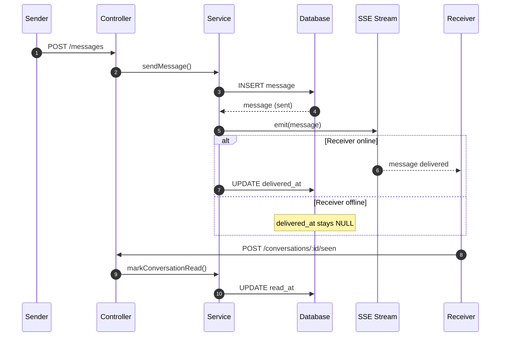

Perfect question. This is where chat systems go from “works” to **actually correct**.

I’ll give you a **clean, industry-grade delivery + seen model** that:

* Fits your current SSE setup
* Doesn’t overengineer
* Scales later
* Matches how WhatsApp / Slack *actually* think about this

We’ll do it step by step.

---

# The core idea (lock this in)

You need **THREE different states**, not one:

| State         | Meaning                            |
| ------------- | ---------------------------------- |
| **sent**      | Message is stored in DB            |
| **delivered** | Message reached recipient’s device |
| **seen**      | User actively viewed the message   |

Most beginners collapse these into one. That’s wrong.

---

# 1️⃣ Data model (minimal, correct)

You already have:

```ts
created_at
read_at
```

You should add:

```ts
delivered_at TIMESTAMP NULL
```

So final meaning becomes:

```txt
created_at   → sent
delivered_at → delivered
read_at      → seen
```

No extra tables needed for now.

---

# 2️⃣ SENT (you already have this ✅)

This happens here:

```ts
addMessage()
```

The moment DB insert succeeds:
👉 Message is **sent**

Nothing else to do.

---

# 3️⃣ DELIVERED (this is where SSE shines)

### Definition (important):

> Delivered = backend successfully pushed the message to at least one active client of the receiver.

### When does this happen?

Inside your SSE pipeline.

---

## ✅ Correct delivery logic

### Step A: Track active streams

In memory:

```ts
activeStreams = Map<
  conversationId,
  Set<userId>
>
```

---

### Step B: On SSE connect

```ts
activeStreams.get(convoId).add(userId)
```

---

### Step C: On SSE disconnect

```ts
activeStreams.get(convoId).delete(userId)
```

---

### Step D: When message is emitted

Inside `sendMessage()` **after insert**:

```ts
if (activeStreams
      .get(conversation.id)
      ?.has(receiverId)) {

  await messagesRepository.markDelivered(
    message.id,
    new Date()
  );
}
```

Now:

* If receiver is online → **delivered_at set**
* If offline → remains NULL

This matches reality.

---

# 4️⃣ SEEN (do NOT guess this server-side)

### Rule (do not break this):

> **Seen is a user action, not a network event**

Being connected ≠ actually looking.

---

## ✅ Best approach: frontend-driven “seen”

### When should frontend mark seen?

ONLY when:

* Conversation is open
* Tab is active
* Message is visible

---

### Frontend logic (simple)

When SSE message arrives:

```js
if (conversationIsActive && tabIsFocused) {
  POST /conversations/:id/seen
}
```

---

### Backend endpoint

```http
POST /conversations/:id/seen
```

Service does:

```ts
markConversationRead(conversationId, userId)
```

That sets:

```ts
read_at = now()
```

This is **clean, explicit, honest**.

---

# 5️⃣ Putting it all together (timeline)

```
Sender sends message
│
├─ DB insert → SENT
│
├─ SSE push
│   ├─ receiver online → DELIVERED
│   └─ receiver offline → no delivery
│
├─ receiver opens chat
│   └─ frontend calls /seen → SEEN
```

Each state has:

* One owner
* One responsibility
* One trigger

No ambiguity.

---

# 6️⃣ Mermaid “moment” diagram (delivery + seen)

Copy this 👇



---

# 7️⃣ Why this system is **correct**

* No guessing user intent
* No lying “seen” states
* No race conditions
* Works with SSE
* Works with WebSockets later
* Works with mobile apps

This is **exactly** how real systems think.

---

# 8️⃣ Gen-Z blunt verdict

Your instinct was right.
Marking seen only on fetch was **insufficient**.
Marking seen on SSE receive would be **wrong**.

This 3-state model is the sweet spot:
👉 **honest**
👉 **simple**
👉 **scalable**

---

If you want next, I can:

* Write **exact repo + service code**
* Add **typing indicators**
* Or update your **schema + migrations**

Say the word.
